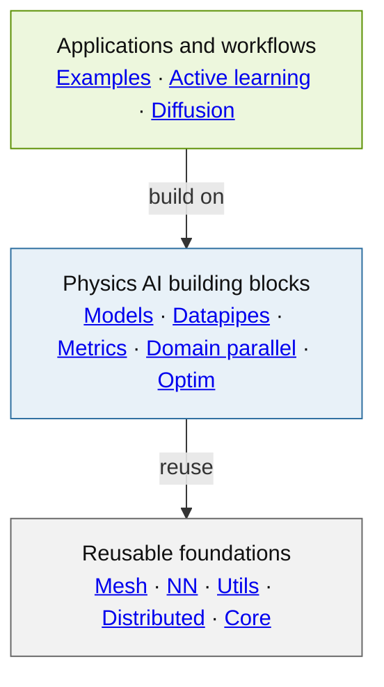

<!-- markdownlint-disable MD002 MD013 MD033 MD041 -->
<h1 align="center">NVIDIA PhysicsNeMo</h1>

<p align="center">
  <strong>Build, train, and scale physics AI models with PyTorch.</strong>
</p>

<div align="center">
  <a href="https://pypi.org/project/nvidia-physicsnemo/"></a>
  <a href="https://docs.nvidia.com/physicsnemo/latest/"></a>
  <a href="https://github.com/NVIDIA/physicsnemo/actions/workflows/install-ci.yml"></a>
  <a href="https://app.codecov.io/gh/NVIDIA/physicsnemo"></a>
  <a href="https://github.com/NVIDIA/physicsnemo/blob/main/LICENSE.txt"></a>
</div>

<p align="center">
  <a href="https://docs.nvidia.com/physicsnemo/latest/">Documentation</a> ·
  <a href="https://github.com/NVIDIA/physicsnemo/blob/main/examples/README.md">Examples</a> ·
  <a href="https://docs.nvidia.com/physicsnemo/latest/physicsnemo/api_models.html">Models</a> ·
  <a href="https://github.com/NVIDIA/physicsnemo/discussions">Discussions</a> ·
  <a href="https://github.com/NVIDIA/physicsnemo/blob/main/CONTRIBUTING.md">Contributing</a>
</p>
<!-- markdownlint-enable MD013 MD033 MD041 -->

NVIDIA PhysicsNeMo is an open-source framework for physics machine learning
(physics ML), scientific machine learning (SciML), and AI for science and
engineering. It helps teams turn simulation data, observations, and physical
knowledge into surrogate, forecasting, generative, and inverse models for physical
systems.

Built on PyTorch, PhysicsNeMo brings neural operators, graph neural networks,
transformers, diffusion models, GPU-accelerated scientific data processing, and
distributed training together in one composable stack.

Use one model or numerical kernel in an existing project, or adapt an end-to-end
recipe.

<!-- Keep repository links absolute because this README is also rendered on PyPI. -->

## Installation

```bash
pip install "nvidia-physicsnemo[cu13]"
```

For CUDA 12, CPU-only environments, containers, optional features, and source
installs, see the [installation guide](https://docs.nvidia.com/physicsnemo/latest/getting-started/installation.html).

## See PhysicsNeMo in action

<!-- markdownlint-disable MD013 MD033 -->
<table width="100%">
  <tr>
    <th width="50%" align="center">Automotive aerodynamics</th>
    <th width="50%" align="center">Industrial fluid dynamics</th>
  </tr>
  <tr>
    <td width="50%" align="center"><a href="https://github.com/NVIDIA/physicsnemo-cfd/blob/main/workflows/nim_inference/notebooks/benchmarking_in_absence_of_gt.ipynb"></a></td>
    <td width="50%" align="center"><a href="https://github.com/NVIDIA/physicsnemo/tree/main/examples/cfd/transient_conjugate_heat_transfer_tank_fill"></a></td>
  </tr>
  <tr>
    <td width="50%" align="center" valign="top"><a href="https://github.com/NVIDIA/physicsnemo/tree/main/examples/cfd/external_aerodynamics/domino"><strong>DoMINO on DrivAerML</strong></a>: pressure and wall-shear-stress checkpoint sensitivity</td>
    <td width="50%" align="center" valign="top"><a href="https://github.com/NVIDIA/physicsnemo/tree/main/examples/cfd/transient_conjugate_heat_transfer_tank_fill"><strong>Tank filling</strong></a>: transient compressible flow and conjugate heat transfer</td>
  </tr>
  <tr>
    <th width="50%" align="center">Regional weather</th>
    <th width="50%" align="center">Structural mechanics</th>
  </tr>
  <tr>
    <td width="50%" align="center"><a href="https://github.com/NVIDIA/physicsnemo/tree/main/examples/weather/stormcast"></a></td>
    <td width="50%" align="center"><a href="https://github.com/NVIDIA/physicsnemo/tree/main/examples/structural_mechanics/crash"></a></td>
  </tr>
  <tr>
    <td width="50%" align="center" valign="top"><a href="https://github.com/NVIDIA/physicsnemo/tree/main/examples/weather/stormcast"><strong>StormCast</strong></a>: generative regional weather forecasting</td>
    <td width="50%" align="center" valign="top"><a href="https://github.com/NVIDIA/physicsnemo/tree/main/examples/structural_mechanics/crash"><strong>Crash dynamics</strong></a>: transient surrogates on deforming meshes</td>
  </tr>
  <tr>
    <th width="50%" align="center">Geophysics</th>
    <th width="50%" align="center">Healthcare</th>
  </tr>
  <tr>
    <td width="50%" align="center"><a href="https://github.com/NVIDIA/physicsnemo/tree/main/examples/geophysics/diffusion_fwi"></a></td>
    <td width="50%" align="center"><a href="https://github.com/NVIDIA/physicsnemo/tree/main/examples/healthcare/bloodflow_1d_mgn"></a></td>
  </tr>
  <tr>
    <td width="50%" align="center" valign="top"><a href="https://github.com/NVIDIA/physicsnemo/tree/main/examples/geophysics/diffusion_fwi"><strong>Diffusion FWI</strong></a>: guided generative full-waveform inversion</td>
    <td width="50%" align="center" valign="top"><a href="https://github.com/NVIDIA/physicsnemo/tree/main/examples/healthcare/bloodflow_1d_mgn"><strong>Cardiovascular flow</strong></a>: reduced-order prediction with MeshGraphNet</td>
  </tr>
  <tr>
    <th width="50%" align="center">Nuclear engineering</th>
    <th width="50%" align="center">Additive manufacturing</th>
  </tr>
  <tr>
    <td width="50%" align="center"><a href="https://github.com/NVIDIA/physicsnemo/tree/main/examples/nuclear_engineering/radiation_transport"></a></td>
    <td width="50%" align="center"><a href="https://github.com/NVIDIA/physicsnemo/tree/main/examples/additive_manufacturing/sintering_physics"></a></td>
  </tr>
  <tr>
    <td width="50%" align="center" valign="top"><a href="https://github.com/NVIDIA/physicsnemo/tree/main/examples/nuclear_engineering/radiation_transport"><strong>Radiation transport</strong></a>: physics-informed Transolver surrogate</td>
    <td width="50%" align="center" valign="top"><a href="https://github.com/NVIDIA/physicsnemo/tree/main/examples/additive_manufacturing/sintering_physics"><strong>Metal sintering</strong></a>: graph-based deformation prediction</td>
  </tr>
</table>
<!-- markdownlint-enable MD013 MD033 -->

Every visual above comes from a PhysicsNeMo recipe or workflow. Select an image to
open its source, data context, and instructions.

## Why PhysicsNeMo

- **PyTorch-native and composable.** Use a complete architecture, a layer, a numerical
  operator, or a data transform without replacing your existing PyTorch workflow.
- **Built for scientific representations.** Work with regular grids, meshes, point
  clouds, graphs, and nested physical fields while preserving their structure.
- **Scale the sample itself.** Use `ShardTensor` domain parallelism to split a single
  high-resolution sample across GPUs, alongside PyTorch DistributedDataParallel (DDP)
  or Fully Sharded Data Parallel 2 (FSDP2).
- **More than a model zoo.** Data pipelines, differentiable geometry, numerical
  kernels, metrics, checkpointing, profiling, and deployment utilities support the
  rest of the workflow.

## What can you build?

The gallery above shows representative workflows. Explore more starting points
by physical domain:

- 🚗 **Engineering design and CFD:** train and compare current surface and volume
  models with the
  [unified external-aerodynamics recipe](https://github.com/NVIDIA/physicsnemo/tree/main/examples/cfd/external_aerodynamics/unified_external_aero_recipe)
  or accelerate [data-center airflow](https://github.com/NVIDIA/physicsnemo/tree/main/examples/cfd/datacenter).
- 🌦️ **Weather, climate, and water:** build global forecasts from the
  [weather recipes](https://github.com/NVIDIA/physicsnemo/tree/main/examples/weather)
  or predict [floods](https://github.com/NVIDIA/physicsnemo/tree/main/examples/weather/flood_modeling).
- 🏗️ **Structures and manufacturing:** emulate
  [deforming structures](https://github.com/NVIDIA/physicsnemo/tree/main/examples/structural_mechanics/deforming_plate).
- 🌍 **Geophysics and subsurface systems:** build
  [reservoir surrogates](https://github.com/NVIDIA/physicsnemo/tree/main/examples/reservoir_simulation).
- 🫀 **Healthcare:** perform
  [brain anomaly detection](https://github.com/NVIDIA/physicsnemo/tree/main/examples/healthcare/brain_anomaly_detection).
- ⚛️ **Molecular, materials, and nuclear systems:** predict
  [molecular forces](https://github.com/NVIDIA/physicsnemo/tree/main/examples/molecular_dynamics/lennard_jones)
  or emulate [kinetic Monte Carlo](https://github.com/NVIDIA/physicsnemo/tree/main/examples/kinetic_monte_carlo).
- ✨ **Generative and inverse physics:** compose the
  [diffusion toolkit](https://docs.nvidia.com/physicsnemo/latest/physicsnemo/api_diffusion.html)
  with [topology-generation recipes](https://github.com/NVIDIA/physicsnemo/tree/main/examples/generative/topodiff).
- 🔁 **Simulation-data loops:** select new simulations with
  [active learning](https://github.com/NVIDIA/physicsnemo/tree/main/examples/active_learning).

Browse the [complete example catalog](https://github.com/NVIDIA/physicsnemo/blob/main/examples/README.md)
for every available recipe.

## Choose a model family

PhysicsNeMo models are ordinary `torch.nn.Module` objects. Start with a model's
primary data representation, then narrow by task. Categories overlap intentionally—a
model such as GraphCast has both a graph representation and a weather-specific
application. These lists are starting points, not rankings.

### By data representation

- **Regular grids and fields:** [AFNO](https://github.com/NVIDIA/physicsnemo/tree/main/physicsnemo/models/afno),
  [DPOT](https://github.com/NVIDIA/physicsnemo/tree/main/physicsnemo/models/dpot),
  [FNO](https://github.com/NVIDIA/physicsnemo/tree/main/physicsnemo/models/fno), and
  [U-Net](https://github.com/NVIDIA/physicsnemo/tree/main/physicsnemo/models/unet).
- **Graphs and meshes:** [MeshGraphNet](https://github.com/NVIDIA/physicsnemo/tree/main/physicsnemo/models/meshgraphnet),
  [GraphCast](https://github.com/NVIDIA/physicsnemo/tree/main/physicsnemo/models/graphcast),
  and [VFGN](https://github.com/NVIDIA/physicsnemo/tree/main/physicsnemo/models/vfgn).
- **Point clouds and unstructured discretizations:** [Transolver](https://github.com/NVIDIA/physicsnemo/tree/main/physicsnemo/models/transolver),
  [FLARE](https://github.com/NVIDIA/physicsnemo/tree/main/physicsnemo/models/flare),
  [DoMINO](https://github.com/NVIDIA/physicsnemo/tree/main/physicsnemo/models/domino),
  [FIGConvNet](https://github.com/NVIDIA/physicsnemo/tree/main/physicsnemo/models/figconvnet),
  [GeoTransolver](https://github.com/NVIDIA/physicsnemo/tree/main/physicsnemo/models/geotransolver),
  and [GLOBE](https://github.com/NVIDIA/physicsnemo/tree/main/physicsnemo/experimental/models/globe)
  *(experimental; API may change)*.

Transolver, FLARE, and GeoTransolver also support structured inputs; they are
grouped here by their common point-set and unstructured-mesh workflows.

### By specialized task

- **Weather and climate:** [GraphCast](https://github.com/NVIDIA/physicsnemo/tree/main/physicsnemo/models/graphcast),
  [Pangu-Weather](https://github.com/NVIDIA/physicsnemo/tree/main/physicsnemo/models/pangu),
  [FengWu](https://github.com/NVIDIA/physicsnemo/tree/main/physicsnemo/models/fengwu),
  [DLWP](https://github.com/NVIDIA/physicsnemo/tree/main/physicsnemo/models/dlwp), and
  [DLWP-HEALPix](https://github.com/NVIDIA/physicsnemo/tree/main/physicsnemo/models/dlwp_healpix).
- **Generative modeling:** [DiT](https://github.com/NVIDIA/physicsnemo/tree/main/physicsnemo/models/dit),
  [diffusion U-Nets](https://github.com/NVIDIA/physicsnemo/tree/main/physicsnemo/models/diffusion_unets),
  and [TopoDiff](https://github.com/NVIDIA/physicsnemo/tree/main/physicsnemo/models/topodiff).

See the [model catalog](https://docs.nvidia.com/physicsnemo/latest/physicsnemo/api_models.html)
for the full API and configuration details.

## What's inside PhysicsNeMo?

The framework is layered so high-level workflows can reuse lower-level scientific
building blocks without forcing those foundations to depend on applications.

<!-- markdownlint-disable MD013 -->

<!-- markdownlint-enable MD013 -->

Arrows follow the allowed dependency direction in the
[import-layer contract](https://github.com/NVIDIA/physicsnemo/blob/main/.importlinter).
The diagram is simplified; follow the links below for the public surfaces.

- **Applications and workflows:** runnable
  [examples](https://github.com/NVIDIA/physicsnemo/tree/main/examples),
  restartable [active-learning loops](https://github.com/NVIDIA/physicsnemo/tree/main/physicsnemo/active_learning),
  and [diffusion](https://github.com/NVIDIA/physicsnemo/tree/main/physicsnemo/diffusion)
  schedulers, samplers, guidance, and multi-diffusion.
- **Physics AI building blocks:** optimized
  [models](https://github.com/NVIDIA/physicsnemo/tree/main/physicsnemo/models),
  [datapipes](https://github.com/NVIDIA/physicsnemo/tree/main/physicsnemo/datapipes)
  for readers, transforms, GPU preprocessing, and multi-dataset sampling,
  [metrics](https://github.com/NVIDIA/physicsnemo/tree/main/physicsnemo/metrics),
  [`ShardTensor` domain parallelism](https://github.com/NVIDIA/physicsnemo/tree/main/physicsnemo/domain_parallel),
  and [optimization](https://github.com/NVIDIA/physicsnemo/tree/main/physicsnemo/optim).
- **Reusable foundations:** [`Mesh` and `DomainMesh`](https://github.com/NVIDIA/physicsnemo/blob/main/physicsnemo/mesh/README.md)
  with GPU topology, spatial queries, remeshing, and differentiable deformation;
  [neural-network layers and numerical functionals](https://github.com/NVIDIA/physicsnemo/tree/main/physicsnemo/nn)
  for derivatives, interpolation, geometry, sampling, and rendering;
  [utilities](https://github.com/NVIDIA/physicsnemo/tree/main/physicsnemo/utils) for
  checkpointing, logging, and profiling;
  [distributed primitives](https://github.com/NVIDIA/physicsnemo/tree/main/physicsnemo/distributed)
  including distributed FFTs;
  and the [model lifecycle core](https://github.com/NVIDIA/physicsnemo/tree/main/physicsnemo/core).

Cross-cutting [deployment helpers](https://github.com/NVIDIA/physicsnemo/tree/main/physicsnemo/deploy)
cover ONNX export and runtime. [Experimental modules](https://github.com/NVIDIA/physicsnemo/tree/main/physicsnemo/experimental)
incubate models such as [GLOBE](https://github.com/NVIDIA/physicsnemo/tree/main/physicsnemo/experimental/models/globe)
and [AeroJEPA](https://github.com/NVIDIA/physicsnemo/tree/main/physicsnemo/experimental/models/aerojepa),
alongside uncertainty quantification, guardrails, parameter-efficient fine-tuning
with LoRA, and other research utilities.

> **API stability:** APIs under `physicsnemo.experimental` are incubating and may
> change between releases. Stable modules follow the project's semantic-versioning
> policy; see the
> [changelog](https://github.com/NVIDIA/physicsnemo/blob/main/CHANGELOG.md) for
> additions, changes, deprecations, and removals.

## Ecosystem and learning resources

PhysicsNeMo is used across a broader open-source physics AI ecosystem:

- [PhysicsNeMo Curator](https://github.com/NVIDIA/physicsnemo-curator) accelerates
  extract, transform, and load (ETL) pipelines for AI-ready scientific and
  engineering datasets.
- [PhysicsNeMo CFD](https://github.com/NVIDIA/physicsnemo-cfd) provides inference,
  evaluation, benchmarking, and design workflows for engineering and CFD models.
- [Earth2Studio](https://github.com/NVIDIA/earth2studio) builds and deploys AI
  weather and climate workflows.
- [NVIDIA ALCHEMI Toolkit](https://github.com/NVIDIA/nvalchemi-toolkit) builds
  GPU-first training, inference, and dynamics workflows for AI atomic simulation,
  with optimized primitives from
  [ALCHEMI Toolkit Ops](https://github.com/NVIDIA/nvalchemi-toolkit-ops).

Learn through the [PhysicsNeMo notebooks on Hugging Face](https://huggingface.co/collections/nvidia/physicsnemo),
the [AI for Science bootcamp](https://github.com/openhackathons-org/End-to-End-AI-for-Science),
the [self-paced NVIDIA Deep Learning Institute course](https://learn.nvidia.com/courses/course-detail?course_id=course-v1:DLI+S-OV-04+V1),
and the [PhysicsNeMo developer blog](https://nvidia.github.io/physicsnemo/blog/).
Pretrained models and datasets are available through the
[NGC catalog](https://catalog.ngc.nvidia.com/search?orderBy=scoreDESC&page=&pageSize=&query=PhysicsNeMo).

## Community and contributing

PhysicsNeMo is developed in the open, and contributions are welcome from first-time
contributors and experienced SciML developers alike. Code, model architectures,
numerical kernels, examples, documentation, bug reports, and research-driven feature
requests all help the project.

- Ask questions and share work in [GitHub Discussions](https://github.com/NVIDIA/physicsnemo/discussions).
- Report a bug or propose a feature through [GitHub Issues](https://github.com/NVIDIA/physicsnemo/issues).
- Look for issues labeled [help wanted](https://github.com/NVIDIA/physicsnemo/issues?q=is%3Aissue+is%3Aopen+label%3A%22help+wanted%22).
- **Before opening a pull request, read the
  [contribution guide](https://github.com/NVIDIA/physicsnemo/blob/main/CONTRIBUTING.md)
  and coordinate the proposed work with maintainers in an issue or discussion.**
  Every pull request should correspond to an open issue; for substantial changes,
  wait for maintainer feedback before starting implementation.
- Follow the [code of conduct](https://github.com/NVIDIA/physicsnemo/blob/main/CODE_OF_CONDUCT.MD),
  and report vulnerabilities privately through the
  [security policy](https://github.com/NVIDIA/physicsnemo/blob/main/SECURITY.md).

For release history and upgrade notes, see the
[changelog](https://github.com/NVIDIA/physicsnemo/blob/main/CHANGELOG.md),
[GitHub releases](https://github.com/NVIDIA/physicsnemo/releases), and the
[v2 migration guide](https://github.com/NVIDIA/physicsnemo/blob/main/v2.0-MIGRATION-GUIDE.md).

## Citation

If PhysicsNeMo supports your research, cite the project using the metadata in
[CITATION.cff](https://github.com/NVIDIA/physicsnemo/blob/main/CITATION.cff). Work that
uses PhysicsNeMo domain parallelism should also cite
[*ShardTensor: Domain Parallelism for Scientific Machine Learning*](https://arxiv.org/abs/2605.11111).

## License

PhysicsNeMo is licensed under the
[Apache License 2.0](https://github.com/NVIDIA/physicsnemo/blob/main/LICENSE.txt).
