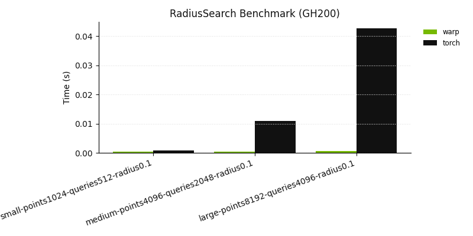

Neighbor Functionals
====================

KNN
---

.. autofunction:: physicsnemo.nn.functional.knn

Radius Search
-------------

.. autofunction:: physicsnemo.nn.functional.radius_search

.. note::

   **Experimental CUDA backends (selectable by name).** When ``max_points`` is set
   and the inputs are on CUDA, alternative neighbor-search kernels can be selected
   directly via ``radius_search(..., implementation="<name>")`` (and therefore via
   any config that forwards ``implementation``, e.g. GeoTransolver's
   ``radius_search_implementation``). Accepted variant names are ``scalar`` /
   ``fma`` / ``gemm`` (hash-grid Morton), ``dense_fma`` / ``dense_fma_e2e`` /
   ``dense_fma_store_opt`` / ``dense_fma_mem_opt`` / ``dense_fma_mm`` /
   ``dense_gemm`` (dense-cell Morton), ``sparse_fma_e2e`` (sparse hash-grid
   cells), and ``bvh`` (Morton-ordered tiled LBVH).
   All of these backends are CUDA-only, require ``max_points`` to be set, and
   return the same output contract as the default backend (neighbor order within
   a query is unspecified).

   The ``PHYSICSNEMO_RADIUS_SEARCH_MORTON`` and ``PHYSICSNEMO_RADIUS_SEARCH_BVH``
   environment variables remain supported as a fallback (used only when no explicit
   ``implementation`` variant is passed); leaving both unset selects the default
   Warp hash-grid implementation.

.. rubric:: Benchmarks (ASV)

