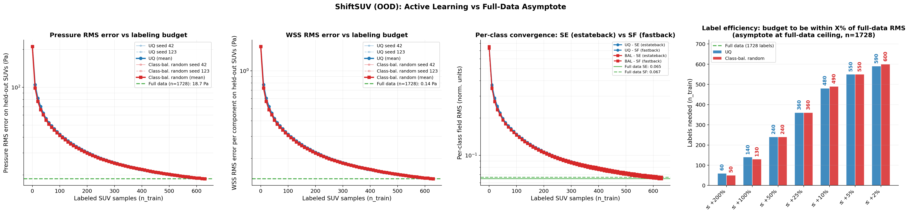

<!-- markdownlint-disable -->
# Active Learning for Surface-CFD Aerodynamic Surrogates

This recipe uses the **uncertainty-aware GeoTransolver + Variational GP
head** trained in [`../transformer_models/`](../transformer_models/README.md#variational-gp-head)
as a starting point and **iteratively fine-tunes it on a target vehicle
class via active learning (AL)**. The driving question is: *given a
pretrained surrogate that is out-of-distribution on a new car family,
how few labelled simulations does it take to recover full-data accuracy?*

The example is implemented for surface CFD on the
[ShiftSUV](https://huggingface.co/datasets/luminary-shift/SUV)
estateback / fastback dataset, but the AL recipe itself is
problem-agnostic: the CFD-specific pieces are isolated to two thin
modules (`aero_physics.py`, `aero_metrology.py`) so the same loop can
drive any uncertainty-quantified regression task. See
[Adapting to a new problem](#adapting-to-a-new-problem) below.

## What this example does

Starting from a GP-augmented GeoTransolver checkpoint that has only ever
seen one body style (the in-distribution / "Fastback" pretrain), the AL
loop:

1. Scores every unlabelled candidate in a held-out target-class pool
   with a **joint UQ signal** — the disagreement between the
   GP-predicted drag and the field-integrated drag, plus the GP's
   posterior variance.
2. Selects the top-`k` most informative samples per round.
3. Adds them to the training set and **fine-tunes** the backbone +
   pooling + GP head jointly (Field MSE + GP ELBO + consistency).
4. Evaluates on a frozen, per-class validation pool, logging
   `field_mse` and per-class breakdowns.
5. Repeats for `al_rounds` iterations, producing a
   `validation_metrics.json` trajectory + per-round checkpoints.

## Architecture

The full AL loop, end-to-end:

```
   ┌──────────────────────────────────────────────────────────────┐
   │  GP-pretrained checkpoint  (from transformer_models/)        │
   └─────────────────────────────┬────────────────────────────────┘
                                 │ load_checkpoint
                                 ▼
   ┌────────────────────────────────────────────────────────────────────┐
   │ Round r = 0                                                        │
   │  ┌──────────────────────┐                                          │
   │  │  Metrology on val    │ ──► field_mse, per-class fmse            │
   │  │ (FieldMetrology)     │                                          │
   │  └──────────────────────┘                                          │
   └────────────────────────────────────────────────────────────────────┘
                                 │
                                 ▼
   ┌────────────────────────────────────────────────────────────────────┐
   │ Round r = 1 … al_rounds                                            │
   │   ┌─────────────────────────────────────────────────┐              │
   │   │  QueryStrategy.score_pool                       │              │
   │   │    JointUQ  : disagreement + GP std            ─┼──► top-k     │
   │   │    Random / ClassBalancedRandom                 │     samples  │
   │   └─────────────────────────────────────────────────┘              │
   │                              │                                     │
   │                              ▼                                     │
   │   ┌─────────────────────────────────────────────────-┐             │
   │   │  fine-tune fine_tune_epochs (CombinedOptimizer): │             │
   │   │    L = field_MSE + λ_gp · GP_ELBO + λ_c · cons.  │             │
   │   └─────────────────────────────────────────────────-┘             │
   │                              │                                     │
   │                              ▼                                     │
   │   ┌──────────────────────┐                                         │
   │   │  Metrology on val    │ ──► validation_metrics.json (per round) │
   │   └──────────────────────┘                                         │
   └────────────────────────────────────────────────────────────────────┘
```

Internally the code is organised as **three architectural layers** that
make customization explicit:

| Layer | Files | What it does | Swap to adapt? |
|-------|-------|--------------|----------------|
| **1. Generic AL recipe** | `run_al.py`, `al_train_step.py`, `strategies.py`, `utils.py` | The driver loop, per-batch training step, query/label strategies, DDP helpers. Knows *nothing* about CFD or aerodynamics. | No — this is the recipe you reuse. |
| **2. GP-UQ recipe** | `gp_utils.py` | Variational GP head wiring: spectral-norm embeddings, ramped weights, gradient sync for non-DDP modules. | Only if you change the UQ method (e.g. swap GP for an ensemble or MC-Dropout). |
| **3. Aero adapter** | `aero_physics.py`, `aero_metrology.py`, `data_pool.py` | Drag integral / freestream non-dimensionalisation, field-MSE metrology, dataset I/O. | **Yes** — this is what you replace for a new problem. |

The split is deliberate: layers 1 and 2 are written against the
`physicsnemo.active_learning` protocols (`QueryStrategy`,
`LabelStrategy`, `MetrologyStrategy`) and the
`physicsnemo.experimental.uq.VariationalGPHead`; layer 3 is the only
place where domain specific stuff like `pressure`, `wss`, `Cd`, or `freestream` appear.

## Example layout

```
active_learning_aero/
├── README.md                  
├── requirements.txt
├── runs/                      ← per-experiment outputs (gitignored)
└── src/
    ├── conf/                  ← Hydra configs (al_config.yaml, …)
    ├── manifests/             ← per-class JSON splits (test/pool)
    ├── run_al.py              ← AL driver (entry point)
    ├── al_train_step.py       ← per-batch training step
    ├── strategies.py          ← Query/Label strategies
    ├── aero_metrology.py      ← FieldMetrologyStrategy
    ├── aero_physics.py        ← drag integral + non-dim constants
    ├── gp_utils.py            ← GP-UQ recipe helpers
    ├── data_pool.py           ← AeroDataPool + build_pool / build_surface_factors
    ├── utils.py               ← CombinedOptimizer, padded_all_gather, …
    ├── infer_aero.py          ← VTP point-cloud predictions
    └── create_manifests.py    ← test/pool split builder
```

Run scripts from the example root (`active_learning_aero/`), so Hydra
resolves `src/conf/` and `src/manifests/` correctly:

```bash
cd examples/cfd/external_aerodynamics/active_learning_aero
torchrun --nproc_per_node=8 src/run_al.py ...
```

## Requirements

This example shares the same dependency closure as the
[GP + GeoTransolver pretraining recipe](../transformer_models/README.md#variational-gp-head),
plus three AL-specific extras: `gpytorch` (variational GP head),
`pyvista` (VTP writing in `infer_aero.py`), and `matplotlib` (the
convergence summary plotter). Install with:

```bash
pip install -r requirements.txt
```

You also need PhysicsNeMo 26.03 or higher.

## Pretraining prerequisite

This example consumes a checkpoint from the GP + GeoTransolver pretraining
recipe — it does **not** train a model from scratch. Before running AL,
follow the steps under
[**Variational GP Head → Training**](../transformer_models/README.md#training)
in the transformer-models README to produce a `checkpoints_combined/`
directory containing the pretrained GeoTransolver, AttentionPooling, and
VariationalGPHead state dictionaries. That path becomes the
`++initial_checkpoint=…` argument below.

## Building the data manifests

Active learning needs a **frozen test set** so that every AL trajectory
is evaluated against the same held-out samples. `create_manifests.py`
walks each class's Zarr directory once and writes a JSON manifest
specifying the test indices (typically the first 100 per class) and
pool indices (the rest) for that class. All AL runs then read the same
manifests, ensuring fair comparison across acquisition strategies and
seeds.

```bash
python src/create_manifests.py \
    --zarr-paths \
        SE=/path/to/shift_suv_estateback_zarr/val \
        SF=/path/to/shift_suv_fastback_zarr/val \
    --test-samples-per-class 100 \
    --output-dir src/manifests
```

This writes `src/manifests/manifest_class_SE.json` and
`src/manifests/manifest_class_SF.json`, each containing
`{class, zarr_path, test_indices, pool_indices}`.

## Quick start

Once the pretraining checkpoint and manifests are in place, launch a
joint-UQ AL experiment on 8 GPUs:

```bash
torchrun --nproc_per_node=8 src/run_al.py \
    --config-name=al_config \
    ++initial_checkpoint=/path/to/checkpoints_combined \
    ++manifest_dir=src/manifests \
    ++acquisition=joint_uq \
    ++samples_per_round=10 \
    ++al_rounds=80 \
    ++fine_tune_epochs=20 \
    ++data.physics_nondim.enabled=true \
    ++data.physics_nondim.U_inf=30.0 \
    ++data.physics_nondim.rho_inf=1.225 \
    ++data.physics_nondim.p_inf=0.0 \
    ++data.physics_nondim.wss_factor=0.00183 \
    ++data.reference_scale=[5.0,5.0,5.0] \
    ++run_id=geotransolver/surface/al_shiftsuv_uq
```

A round-1 smoke test (single GPU, two samples, one fine-tune epoch)
typically completes in a few minutes:

```bash
torchrun --nproc_per_node=1 src/run_al.py \
    --config-name=al_config \
    ++initial_checkpoint=/path/to/checkpoints_combined \
    ++manifest_dir=src/manifests \
    ++samples_per_round=2 \
    ++al_rounds=1 \
    ++fine_tune_epochs=1 \
    ++run_id=_smoke
```

Outputs land under `runs/<run_id>/<acquisition>/`:

```
runs/geotransolver/surface/al_shiftsuv_uq/joint_uq/
├── checkpoint_round_{1,2,…}/   ← per-round model state
├── selection_history.json       ← which sample indices were acquired each round
└── validation_metrics.json      ← per-round field_mse + per-class breakdown
```

## Acquisition strategies

Three strategies ship with this example, all implementing the
`physicsnemo.active_learning.QueryStrategy` protocol. Select via
`++acquisition=…`:

| Strategy | `++acquisition=` | When to use |
|----------|------------------|-------------|
| **JointUQQueryStrategy** | `joint_uq` | The recommended UQ-driven default. Per-sample score is `max(|disagreement|, 2 · GP_std)`, where *disagreement* is `|Cd_GP − Cd_field|` — i.e. the gap between the GP-head Cd prediction and the field-integrated Cd recovered from the same forward pass. |
| **RandomQueryStrategy** | `random` | Pure random baseline (uniform over the pool). Use as a UQ-vs-random sanity check. |
| **ClassBalancedRandomQueryStrategy** | `class_balanced_random` | Random *within each class*, with the per-round budget split proportionally. Use as a strong baseline that controls for class imbalance in the pool. |

Adding a new strategy is a matter of subclassing `QueryStrategy` from
`physicsnemo.active_learning.protocols`, implementing
`select(pool, budget, …) → list[int]`, and registering it in the
`if/elif` block near the top of `run_al.py`. The driver itself is
acquisition-agnostic.

There is also a single `DummyLabelStrategy` (`LabelStrategy` protocol)
that no-ops because labels are pre-computed on disk; replace it if your
AL setup involves an oracle that synthesises labels on demand.

## Results

The plot below summarises a single-seed experiment on the ShiftSUV
out-of-distribution pool (1728 candidates after holding out 200 for
test). UQ and class-balanced random both close the gap between the
pretrained Fastback-only model and a full-data ceiling that sees every
training sample (n = 1728). Pressure and wall-shear-stress (WSS) RMS
errors are reported in physical units after un-standardisation.



Headline numbers from the rightmost panel — **labels needed to land
within X% of the full-data RMS asymptote** (n_pool = 1728):

| Within X% of ceiling | Joint-UQ labels | Class-bal random labels | Fraction of pool |
|----------------------|-----------------|-------------------------|------------------|
| 200% | ~50 | ~50 | ~3% |
| 100% | ~140 | ~130 | ~8% |
| 50% | ~240 | ~240 | ~14% |
| 25% | ~360 | ~340 | ~20% |
| 10% | ~480 | ~520 | ~28% |
| 5% (engineering accuracy) | ~550 | ~550 | ~32% |
| 2% | ~580 | ~600 | ~34% |

Read the labels-to-engineering-accuracy column as: *"to drive the
surface-field RMS to within 5% of what training on every available
sample would give us, we need to hand-label only ~32% of the pool"*.

## Adapting to a new problem

The AL loop in this example is not specific to surface CFD. To retarget
it to a different uncertainty-quantified regression task:

1. **Replace `aero_physics.py`.** This module owns the constants and
   per-batch operators that turn raw model outputs into the scalar
   quantity of interest for AL scoring (here: drag coefficient via
   surface integration). Define your own QoI integral / non-dim
   scaling — anything that maps `(B, N, output_dim)` to `(B,)`.
2. **Replace `aero_metrology.py`.** This module owns the
   `MetrologyStrategy` that runs over a frozen validation pool each
   round and writes the headline metric to `validation_metrics.json`.
   For a different QoI, swap the per-class `field_mse` for whatever
   accuracy / calibration metric matters for your domain.
3. **Regenerate manifests** with `create_manifests.py` (or write your
   own splitter) so each "class" in your problem has a frozen test set
   and an AL pool. The split is what guarantees apples-to-apples
   trajectory comparison.

## References

- **GeoTransolver:** [GeoTransolver](https://arxiv.org/abs/2512.20399), built on the [Transolver](https://arxiv.org/abs/2402.02366) backbone with GALE attention.
- **Variational GP head:** [Scalable Variational Gaussian Process Classification](https://arxiv.org/abs/1411.2005) — Hensman et al., 2015.
- **SNGP / DUE:** [Simple and Principled Uncertainty Estimation with Deterministic Deep Learning](https://arxiv.org/abs/2006.10108) — van Amersfoort et al., 2020.
- **Active learning with GPs / disagreement:** [BatchBALD](https://arxiv.org/abs/1906.08158) — Kirsch et al., 2019; [Query-by-committee](https://dl.acm.org/doi/10.1145/130385.130417) — Seung et al., 1992.
- **DrivAerStar dataset:** [DrivAerStar: A Body-Fitted Overset Mesh Dataset for Automotive External Aerodynamics](https://arxiv.org/abs/2510.16857) — Qiu et al., 2025.
