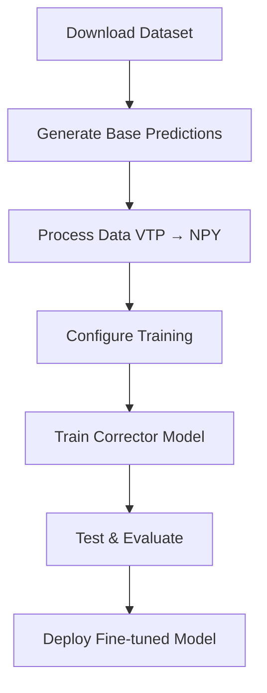

# DoMINO-Automotive-Aero NIM Fine-tuning

## Overview

This example showcases an **advanced fine-tuning recipe** for the **DoMINO-Automotive-Aero NIM** model, featuring an innovative **predictor-corrector approach** specifically designed for automotive CFD simulations.

**Accelerated Training**: Dramatically reduce training time by leveraging pre-trained foundation models instead of starting from scratch

**Smart Transfer Learning**: Efficiently adapt powerful base models to new vehicle configurations and boundary conditions

**Predictor-Corrector Approach**: A novel approach that combines the strengths of pre-trained models with AI model based corrections

### How It Works

The predictor-corrector methodology is described below:

```
Y_finetuned = Y_predictor + Y_corrector
```

**The Components:**
- **Y_predictor**: Output from the pre-trained DoMINO-Automotive-Aero NIM (frozen weights)
- **Y_corrector**: A lightweight, trainable network that learns to correct prediction errors
- **Y_finetuned**: The final enhanced prediction combining both components

> **💡 Core Insight**: The predictor leverages extensive pre-training to provide robust baseline predictions, while the corrector focuses on learning dataset-specific refinements. This division of labor leads to faster convergence and superior performance compared to training from scratch.

### Key Features

- **Predictor-Corrector Approach**: Combines pre-trained models with learnable corrections
- **Transfer Learning**: Efficient adaptation to new vehicle configurations and boundary conditions  
- **DrivAerML Integration**: Seamless integration with the DrivAerML dataset
- **Modular Design**: Easy customization of both predictor and corrector models
- **High Performance**: Optimized for multi-GPU training and inference

### Architecture Components

| Component | Description | Training Mode |
|-----------|-------------|---------------|
| **Predictor** | Pre-trained DoMINO-Automotive-Aero NIM | Frozen (Evaluation Only) |
| **Corrector** | Custom DoMINO architecture | Trainable |
| **Combined** | Predictor + Corrector outputs | End-to-End Inference | 

## Repository Structure

```
domino_automotive_aero_nim_finetuning/
├── src/                           # Core Implementation
│   ├── conf/                      # Configuration Management
│   │   ├── config.yaml           # Main training configuration
│   │   └── config_base_pred.yaml # Base prediction settings
│   ├── model_base_predictor.py   # DoMINO predictor architecture
│   ├── train.py                  # Training pipeline
│   ├── test.py                   # Testing & inference pipeline
│   ├── generate_base_predictions.py # Base model predictions
│   ├── process_data.py           # Data preprocessing utilities
│   └── openfoam_datapipe.py      # VTK → NPY conversion
├── nim_checkpoint/               # Pre-trained Models
│   └── domino-drivesim-recent.pt # Pretrained model weights
├── download_dataset_huggingface.sh # Automated dataset download
└── README.md                     # This documentation
```

## Dataset & Model Setup

### DrivAerML Dataset

The **DrivAerML** dataset provides comprehensive automotive CFD simulations with multiple vehicle configurations:

| File Type | Description | Extension | Use Case |
|-----------|-------------|-----------|----------|
| **Geometry** | Vehicle STL meshes | `.stl` | 3D vehicle structure |
| **Volume Fields** | 3D flow field data | `.vtu` | Velocity, pressure, turbulence |
| **Surface Fields** | Vehicle surface data | `.vtp` | Wall pressure, shear stress |
| **Force Data** | Aerodynamic coefficients | `.csv` | Drag, lift, moments |

### Dataset Download

```bash
# Download specific runs (e.g., runs 1-32)
./download_dataset_huggingface.sh -d ./drivaer_data -s 1 -e 32
```

### DoMINO-Automotive-Aero NIM Checkpoint

Download the DoMINO-Automotive-Aero NIM checkpoint from NGC

**Source**: [NVIDIA NGC Catalog](https://catalog.ngc.nvidia.com/orgs/nim/teams/nvidia/containers/domino-automotive-aero)

```bash
# Download pre-trained checkpoint
wget -O nim_checkpoint/domino-drivesim-recent.pt \
     "https://api.ngc.nvidia.com/v2/models/nvidia/nim/domino-automotive-aero/files?redirect=true&path=domino-drivesim-recent.pt"
```

**Note**: Requires NGC API key for access. See [NGC documentation](https://docs.nvidia.com/ngc/) for setup.

## Usage Guide

### Complete Fine-tuning Workflow

<div align="center">



</div>

### Step-by-Step Instructions

#### **Step 1: Generate Base Predictions**
Generate initial predictions using the pre-trained DoMINO-Automotive-Aero NIM. Modify the eval tab in `config_base_pred.yaml` to specify the path to the pre-trained checkpoint.

```bash
# Run predictor model on dataset
python src/generate_base_predictions.py

# Output: Predictions saved as VTP files with base model outputs
```

#### **Step 2: Data Processing (VTP → NPY)**
Convert VTP prediction files to efficient NPY format for training:

```bash
# Convert and preprocess data
python src/process_data.py

# Output: Training-ready NPY files with predictor outputs + ground truth
```

#### **Step 3: Train Corrector Model**
Train the corrector network to learn prediction refinements:

```bash
# Start training with default configuration
python src/train.py exp_tag=combined

# Custom configuration example
python src/train.py \
    exp_tag=high_resolution \
    model.volume_points_sample=16384 \
    model.surface_points_sample=16384 \
    train.epochs=500
```

#### **Step 4: Test Fine-tuned Model**
Evaluate the combined predictor-corrector model:

```bash
# Run inference on test dataset
python src/test.py \
    exp_tag=combined \
    eval.checkpoint_name=DoMINO.0.500.pt \
    eval.save_path=/path/to/results

# Output: Final predictions combining predictor + corrector
```

## Benchmarking results on DrivAerML dataset 

The finetuning recipe is benchmarked for a subset of the DrivAerML dataset. The finetuning is carried out on the first 24 samples from this dataset and compared against training from scratch with the DoMINO model on the same dataset. The DoMINO-Automotive-Aero NIM is trained on a dataset consisting of RANS simulations and does not include the DrivAer geometries, while this dataset consists of high-fidelity, time-averaged LES simulations. The goal of this recipe is to demonstrate the finetuning of an existing model checkpoint to a new design space and physics and compare it against training from scratch. 

Both models are evaluated at 50, 100, 200, 300, 400 and 500 epochs to demonstrate faster convergence of the finetuned model to an acceptable accuracy as compared to training from scratch. 18 samples are used for training and 6 for validation. The results averaged over the validation set are presented in the table below and demonstrate that finetuning results in faster convergence of results as compared to training from scratch.

| Epochs | Baseline Model $L_2$ Error | | | | Fine-tuned Model $L_2$ Error | | | |
|--------|----------|----------|----------|----------|----------|----------|----------|----------|
| | $vel$ | $Vol p$ | $Surf p$ | $wall-shear$ | $vel$ | $Vol p$ | $Surf p$ | $wall-shear$ |
| 50 | 0.521 | 0.558 | 0.546 | 0.683 | 0.342 | 0.316 | 0.374 | 0.563 |
| 100 | 0.444 | 0.474 | 0.436 | 0.613 | 0.332 | 0.307 | 0.333 | 0.473 |
| 200 | 0.405 | 0.388 | 0.386 | 0.571 | 0.313 | 0.303 | 0.312 | 0.416 |
| 300 | 0.390 | 0.365 | 0.369 | 0.563 | 0.310 | 0.301 | 0.308 | 0.406 |
| 400 | 0.384 | 0.362 | 0.365 | 0.552 | 0.309 | 0.300 | 0.307 | 0.403 |

It must be noted that the training and validation accuracy for training from scratch can be improved as more samples are added and the same is the case with finetuning. A more comprehensive analysis correlating the training from scratch and finetuning accuracy with the dataset size will be published as a separate paper. The goal of this analysis is to demonstrate the benefits of finetuning a model from a foundational model checkpoint as compared to training from scratch.

## Customization & Extensions

### Custom Model Architectures

The recipe is designed for easy customization:

| Component | File | Customization Level |
|-----------|------|-------------------|
| **Predictor** | `model_base_predictor.py` | **Interface Only** |
| **Corrector** | Built-in DoMINO | **Fully Customizable** |
| **Training** | `train.py` | **Configuration-driven** |
| **Testing** | `test.py` | **Workflow Adaptable** |

### Integration Guidelines

**Key Design Principle**: The predictor-corrector approach is model-agnostic!

**To use custom architectures:**

1. **Custom Predictor**: Replace `model_base_predictor.py` with your foundation model
2. **Custom Corrector**: Modify the corrector architecture in training configuration  
3. **Maintain Interface**: Ensure input/output compatibility between components
4. **Update Testing**: Adapt `test.py` for new model combinations

```python
# Example: Custom predictor integration
class CustomPredictorModel(nn.Module):
    def forward(self, geometry, boundary_conditions):
        # Your custom prediction logic
        return predictions

# The corrector training remains unchanged!
```

---

## Additional Resources

### Quick Links
- [DoMINO-Automotive-Aero NIM Docs](https://docs.nvidia.com/nim/physicsnemo/domino-automotive-aero/latest/overview.html)
- [DrivAerML Dataset](https://caemldatasets.org/drivaerml/)
