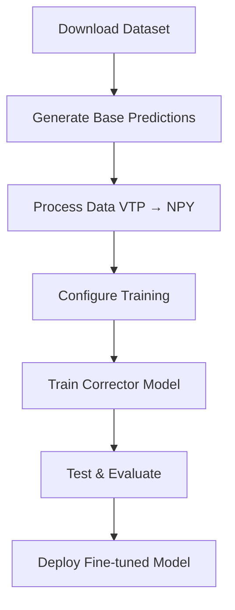

# DoMINO-Automotive-Aero NIM Fine-tuning

This recipe contains the implementation for fine-tuning the DoMINO model for external aerodynamics CFD simulations.

## Overview

This fine-tuning recipe demonstrates a predictor-corrector approach to finetune the Domino-Automotive-Aero NIM (https://catalog.ngc.nvidia.com/orgs/nim/teams/nvidia/containers/domino-automotive-aero) to the DrivAerML dataset. It enables efficient transfer learning from pre-trained base models to datasets with new simulation and boundary condition configurations. Although the finetuning recipe is demonstrated with the DoMINO-Automotive-Aero NIM as the base predictor model and another instance of the DoMINO model as the corrector model, it is not restricted to that. The recipe can be easily modified to utilize custom base predictor and corrector AI models.

The predictor-corrector approach is briefly described next. In this approach, the predictor is a base pretrained model (possibly a founcational AI model) that is trained for a large simualtion dataset spanning an extensive design space. In this approach, the pretrained model weights remain fixed and is used only in evaluation mode. The corrector is a custom model architecture that is trainable and aims to learn the correction between the predictor and the ground truth data for a dataset with a different design space and simulation settings.

$Y_finetuned = Y_predictor + Y_corrector$, where $Y$ represents a solution field such as velocity, pressure etc. $Y_predictor$ is calculated using a pretrained checkpoint at each mesh point and $Y_corrector$ is trained to minimize the error between $Y_finetuned$ and $Y_truth$. 

## Overview

This repository contains an advanced fine-tuning recipe for the **DoMINO-Automotive-Aero NIM** model, demonstrating a state-of-the-art **predictor-corrector approach** for automotive CFD simulations. The finetuning recipe uses a predictor-corrector approach. The predictor-corrector approach follows the principle:
```
Y_finetuned = Y_predictor + Y_corrector
```

where:
- **Y_predictor**: Output from the pre-trained foundation model (frozen weights)
- **Y_corrector**: Learnable correction term trained to minimize prediction errors  
- **Y_finetuned**: Final prediction combining both components

> **Key Insight**: The predictor provides a strong baseline from extensive pre-training, while the corrector learns dataset-specific refinements.

### Key Features

- **Predictor-Corrector Approach**: Combines pre-trained foundation models with learnable corrections
- **Transfer Learning**: Efficient adaptation to new vehicle configurations and boundary conditions  
- **DrivAerML Integration**: Seamless integration with the AWS DrivAer dataset
- **Modular Design**: Easy customization of both predictor and corrector models
- **High Performance**: Optimized for multi-GPU training and inference

### Architecture Components

| Component | Description | Training Mode |
|-----------|-------------|---------------|
| **Predictor** | Pre-trained DoMINO-Automotive-Aero NIM | Frozen (Evaluation Only) |
| **Corrector** | Custom DoMINO architecture | Trainable |
| **Combined** | Predictor + Corrector outputs | End-to-End Inference | 

## Repository Structure

```
domino_automotive_aero_nim_finetuning/
├── src/                           # Core Implementation
│   ├── conf/                      # Configuration Management
│   │   ├── config.yaml           # Main training configuration
│   │   └── config_base_pred.yaml # Base prediction settings
│   ├── model_base_predictor.py   # DoMINO predictor architecture
│   ├── train.py                  # Training pipeline
│   ├── test.py                   # Testing & inference pipeline
│   ├── generate_base_predictions.py # Base model predictions
│   ├── process_data.py           # Data preprocessing utilities
│   └── openfoam_datapipe.py      # VTK → NPY conversion
├── nim_checkpoint/               # Pre-trained Models
│   └── domino-drivesim-recent.pt # Foundation model weights
├── download_dataset_huggingface.sh # Automated dataset download
└── README.md                     # This documentation
```

## Dataset & Model Setup

### AWS DrivAer Dataset

The **DrivAerML** dataset provides comprehensive automotive CFD simulations with multiple vehicle configurations:

| File Type | Description | Extension | Use Case |
|-----------|-------------|-----------|----------|
| **Geometry** | Vehicle STL meshes | `.stl` | 3D vehicle structure |
| **Volume Fields** | 3D flow field data | `.vtu` | Velocity, pressure, turbulence |
| **Surface Fields** | Vehicle surface data | `.vtp` | Wall pressure, shear stress |
| **Force Data** | Aerodynamic coefficients | `.csv` | Drag, lift, moments |

### Dataset Download

```bash
# Download specific runs (e.g., runs 1-32)
./download_dataset_huggingface.sh -d ./drivaer_data -s 1 -e 32
```

### DoMINO-Automotive-Aero NIM Checkpoint

Download the DoMINO-Automotive-Aero NIM checkpoint from NGC

**Source**: [NVIDIA NGC Catalog](https://catalog.ngc.nvidia.com/orgs/nim/teams/nvidia/containers/domino-automotive-aero)

```bash
# Download pre-trained checkpoint
wget -O nim_checkpoint/domino-drivesim-recent.pt \
     "https://api.ngc.nvidia.com/v2/models/nvidia/nim/domino-automotive-aero/files?redirect=true&path=domino-drivesim-recent.pt"
```

**Note**: Requires NGC API key for access. See [NGC documentation](https://docs.nvidia.com/ngc/) for setup.

## Usage Guide

### Complete Fine-tuning Workflow

<div align="center">



</div>

### Step-by-Step Instructions

#### **Step 1: Generate Base Predictions**
Generate initial predictions using the pre-trained DoMINO-Automotive-Aero NIM. Modify the eval tab in `config_base_pred.yaml` to specify the path to the pre-trained checkpoint.

```bash
# Run predictor model on dataset
python src/generate_base_predictions.py

# Output: Predictions saved as VTP files with base model outputs
```

#### **Step 2: Data Processing (VTP → NPY)**
Convert VTP prediction files to efficient NPY format for training:

```bash
# Convert and preprocess data
python src/process_data.py

# Output: Training-ready NPY files with predictor outputs + ground truth
```

#### **Step 3: Train Corrector Model**
Train the corrector network to learn prediction refinements:

```bash
# Start training with default configuration
python src/train.py exp_tag=combined

# Custom configuration example
python src/train.py \
    exp_tag=high_resolution \
    model.volume_points_sample=16384 \
    model.surface_points_sample=16384 \
    train.epochs=500
```

#### **Step 4: Test Fine-tuned Model**
Evaluate the combined predictor-corrector model:

```bash
# Run inference on test dataset
python src/test.py \
    exp_tag=combined \
    eval.checkpoint_name=DoMINO.0.500.pt \
    eval.save_path=/path/to/results

# Output: Final predictions combining predictor + corrector
```

## Customization & Extensions

### Custom Model Architectures

The recipe is designed for easy customization:

| Component | File | Customization Level |
|-----------|------|-------------------|
| **Predictor** | `model_base_predictor.py` | **Interface Only** |
| **Corrector** | Built-in DoMINO | **Fully Customizable** |
| **Training** | `train.py` | **Configuration-driven** |
| **Testing** | `test.py` | **Workflow Adaptable** |

### Integration Guidelines

**Key Design Principle**: The predictor-corrector approach is model-agnostic!

**To use custom architectures:**

1. **Custom Predictor**: Replace `model_base_predictor.py` with your foundation model
2. **Custom Corrector**: Modify the corrector architecture in training configuration  
3. **Maintain Interface**: Ensure input/output compatibility between components
4. **Update Testing**: Adapt `test.py` for new model combinations

```python
# Example: Custom predictor integration
class CustomPredictorModel(nn.Module):
    def forward(self, geometry, boundary_conditions):
        # Your custom prediction logic
        return predictions

# The corrector training remains unchanged!
```

---

## Additional Resources

### Quick Links
- [DoMINO-Automotive-Aero NIM Docs](https://docs.nvidia.com/nim/physicsnemo/domino-automotive-aero/latest/overview.html)
- [AWS DrivAer Dataset](https://caemldatasets.org/drivaerml/)
