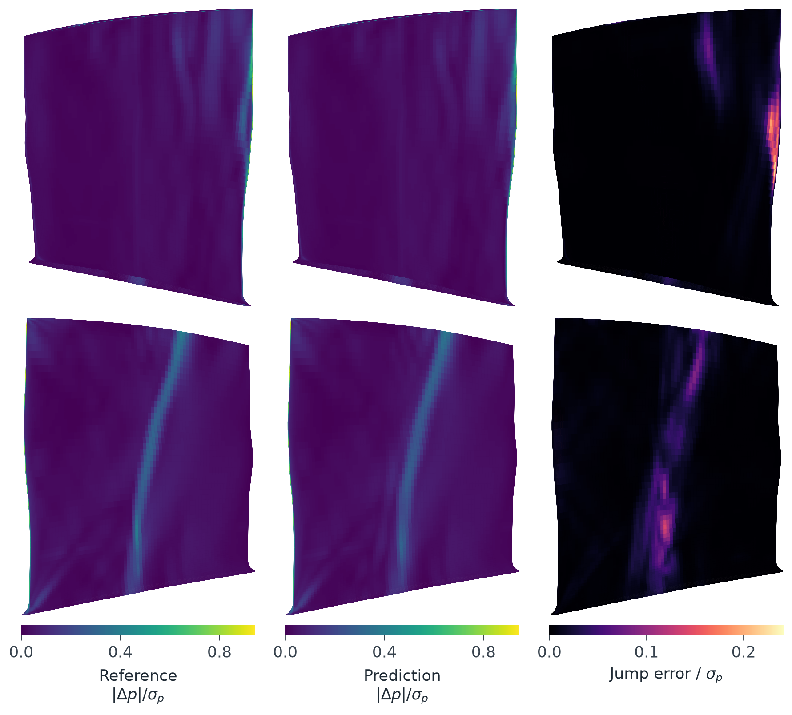
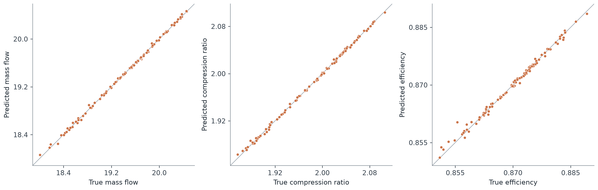

# GeoTransolver for Rotor37 Compressor Blades

This example trains PhysicsNeMo GeoTransolver to predict the surface density,
pressure and temperature of a transonic compressor blade, together with its mass
flow, compression ratio and efficiency, from the blade shape and two operating
conditions. A trained model predicts a complete blade surface, including its
shock, in about 5 ms.



Validation case 613 seen from both sides of the blade. The columns show the
simulated pressure jumps across mesh edges, the predicted jumps and their error.

The example doubles as a walkthrough. Besides the commands to run it, it explains
what makes the problem hard, which approaches come to mind first, why they
struggle here, and how each part of the recipe answers one difficulty. The same
reasoning applies to many surrogate models of engineering surfaces.

## The recipe at a glance

```text
blade surface + operating conditions
  -> 66 case features and 2,048 surface points       (step 4)
  -> GeoTransolver                                   (step 5)
  -> 3 compressor outputs and 349 mode coefficients  (step 1)
  -> fixed decoder, exp and ideal-gas relation       (step 2)
  -> density, pressure and temperature on all 29,773 vertices
```

| Difficulty | How the recipe handles it | Step |
| --- | --- | --- |
| 800 training cases but 89,319 field values per case | Predict coefficients of fixed spatial modes | 1 |
| Pressure, temperature and density must be positive and consistent | Log fields, exponentiation and density from the gas law | 2 |
| Pointwise errors hardly notice a smeared shock | Edge-aware modes and a pressure jump loss | 3 |
| The blade shape is a 3D surface | Principal components of coordinates and normals, plus surface points | 4 |
| Choosing the network | GeoTransolver, with a multilayer perceptron baseline | 5 |
| Little data for a large network | Zero-initialized inputs and outputs, balanced loss | 6 |

## Problem overview

NASA Rotor 37 is a transonic axial compressor rotor and a standard test case for
turbomachinery simulation. Near the blade tip the relative flow is supersonic,
so a shock forms on the blade where the surface pressure rises sharply over a
few mesh cells. The position and strength of the shock depend on the blade shape
and the operating point, and they strongly influence losses and efficiency.

Each Reynolds-averaged Navier-Stokes simulation is expensive, while design
studies need many blade shapes and operating points. A surrogate that maps a
blade and its operating conditions directly to the surface fields and the
compressor performance makes that exploration interactive.

| Inputs | Outputs |
| --- | --- |
| Blade surface coordinates and normals | Surface density, pressure and temperature |
| Rotational speed `Omega` and pressure parameter `P` | Mass flow, compression ratio and efficiency |

## Dataset

The [PLAID Rotor37 dataset](https://huggingface.co/datasets/PLAID-datasets/Rotor37)
contains simulations of 1,200 blade geometries and operating points. All blade
surfaces share one mesh with 29,773 vertices, 29,664 quadrilateral faces and
59,436 unique edges, so a vertex index refers to the same location on every
blade. The source does not declare physical units, so errors are reported in the
original numerical scales.

The 1,000 labeled cases are split into 800 training, 100 validation and 100 test
cases with split seed 42. The 200 official test cases have withheld targets.
Every normalization, geometry encoding and field basis is fitted to the 800
training cases only, so no information from evaluation cases reaches the model.

The dataset is owned by Safran and distributed under
[CC BY-SA 4.0](https://creativecommons.org/licenses/by-sa/4.0/).

## What makes this problem hard

Four properties of the data shape the design. The training set is small, 800
simulations, while each simulation carries 89,319 field values, so a model with
a free output per vertex has far more freedom than the data can constrain. The
fields are smooth almost everywhere but jump across the shock, and pointwise
error metrics are nearly blind to a shock that is smeared or slightly misplaced,
even though the shock is what an engineer looks at first. The outputs are
physical quantities, positive and linked by the ideal-gas relation, which
independent predictions can violate. Finally, the input is a full 3D blade
surface that has to be summarized compactly enough to learn from 800 examples
while keeping the detail that moves the shock.

One property works in our favor. All blades share the same mesh, so the fields
of different cases can be compared vertex by vertex. Each step below builds on
this.

## The approach, step by step

### Step 1. What should the network predict?

The natural starting point is to predict density, pressure and temperature
vertex by vertex, as point cloud and graph networks do. That is the right tool
when every case has its own mesh, but here it forces the network to learn from
800 examples that neighboring vertices behave alike, and nothing ensures that
the 29,773 values it produces for a blade form one coherent field.

The shared mesh suggests a better representation. A pressure field is then a
vector of 29,773 values in a fixed order, and the 800 training fields can be
compared entry by entry. They do not vary arbitrarily but along a limited number
of typical patterns, such as a change of the overall pressure level with the
operating point or a shift of the shock along the blade. Proper orthogonal
decomposition, equivalent to principal component analysis, extracts these
patterns as a mean field and a set of spatial **modes** ordered by how much of
the training variation they explain. Each field is then approximated by the mean
plus a weighted sum of modes,

$$
\log p(\mathbf x) \approx \overline{\log p}(\mathbf x) +
\sum_{k=1}^{248} c_k\, \phi_k(\mathbf x),
$$

where the mean and the modes $\phi_k$ are computed once from the training data
and only the **coefficients** $c_k$ change from blade to blade. With 248
pressure modes and 101 temperature modes, the expansion reproduces 99.9% of the
training variation. The network predicts these 349 coefficients together with
the three compressor outputs, and a fixed decoder evaluates the expansion on all
29,773 vertices. The logarithm in the expansion is explained in step 2.

| | Value at every vertex | Mode coefficients |
| --- | --- | --- |
| Numbers predicted per blade | 89,319 | 349 |
| Smooth, consistent fields | Must be learned from the data | Built in, since every mode is a pattern from real simulations |
| Blades on a different mesh | Supported | Not supported without first mapping them to this mesh |
| Patterns never seen in training | Possible | Only combinations of training patterns |

The last two rows are the price of this representation. For design studies on
one fixed mesh, as here, it is a favorable trade.

### Step 2. How do predictions stay physical?

The modes describe log pressure and log temperature, so the decoded fields are
positive for any coefficients. Density is not predicted but computed from the
ideal-gas relation $\hat\rho = \hat p / (R\hat T)$, with $R$ fitted to the
training fields, so the three fields always agree.

### Step 3. How is the shock kept sharp?

A shock is a jump in pressure between neighboring vertices. If a prediction
spreads that jump over five cells instead of one, or shifts it by a cell, only
the few vertices at the shock are wrong. The average pointwise error hardly
changes, although the most important feature of the flow is lost, so a model
trained on pointwise errors alone has little incentive to resolve shocks.

Pressure differences across mesh edges behave differently. They are large
exactly at the shock and small elsewhere, so measuring errors in these
differences makes a blurred or misplaced shock expensive. The recipe uses them
twice. When the modes are selected, a sharp shock occupies so few vertices that,
measured pointwise, its patterns explain little variation and would be
discarded. The pressure modes are therefore ranked by a measure that counts edge
differences as much as pointwise values, which retains the patterns that
describe sharp transitions. During training, a jump term compares predicted and
simulated pressure differences over all mesh edges $E$,

$$
\mathcal L_{\mathrm{jump}} =
\frac{1}{C_p |E|}\sum_{(i,j)\in E}
\left[\frac{(\hat p_i-\hat p_j)-(p_i-p_j)}{\sigma_p}\right]^2 ,
$$

where pressure is divided by its training standard deviation $\sigma_p$ and the
sum by $C_p$, its value when every blade is predicted with the training mean
pressure. A value of 1 therefore means no better than the mean, which keeps the
term on the scale of the other losses. Because differences cannot detect a
constant offset of the whole field, the ordinary pointwise loss remains to fix
the pressure level.

### Step 4. How does the geometry enter?

In raw form the blade is 29,773 points in 3D, about 90,000 numbers to relate to
only 800 examples. Since the training blades are variations of one design, their
shapes differ along a limited number of deformations, just as the fields do in
step 1, and principal component analysis again provides a compact description.
Each blade is summarized by 66 features.

| Features | Count | What they describe |
| --- | --- | --- |
| Operating conditions `Omega` and `P` | 2 | The flow regime |
| Components of the displacement from the average blade | 32 | The overall shape |
| Components of the surface normals | 32 | Local curvature, such as the shape of the leading edge |

The normal features matter because small, sharp shape details barely move the
surface coordinates yet strongly change the surface orientation, and they affect
where the shock forms. Without them, the error on the strongest pressure jumps
grows by about half. All features are standardized to zero mean and unit
variance over the training blades so that they reach the network on a common
scale.

The number of components is a trade-off. Too few discard shape details that
move the shock. Too many add components that capture small, largely random
variations, which standardization then weights as heavily as the important
ones. Halving or quadrupling the 32 components per group both make validation
errors clearly worse. Alongside the 66 features, the network also receives
2,048 points of the blade surface with their coordinates, normals and
displacements.

### Step 5. Which network?

The learning task is now to map the 66 features and the surface points of a
blade to 352 numbers, the three compressor outputs and 349 mode coefficients.
Three families of PhysicsNeMo models fit this description. A multilayer
perceptron reads only the 66 features. It is the simplest option and serves as
the baseline, available as `model=mlp`. A Fourier neural operator learns
convolutions in Fourier space over a regular grid, and since the Rotor37 mesh is,
apart from the tip, a regular sheet of 133 by 216 vertices wrapped around the
blade, it can treat the surface as an image. GeoTransolver, a transformer for
physics on geometry, builds an internal representation of the case from the 66
features and refines it by attending to the surface points, so it can draw on
local shape information wherever it helps. The configuration used here has four
GALE layers, 512 hidden channels, four attention heads and 32 slices.

Trained with the same modes, losses and schedule, the three models reach the
following validation errors, averaged over three training seeds.

| Network | Parameters | Pressure relative L2 | Jump RMSE / $\sigma_p$ | Strongest 1% jump RMSE / $\sigma_p$ |
| --- | --- | --- | --- | --- |
| GeoTransolver | 8.8 million | 0.457% | 0.0055 | 0.0107 |
| GeoTransolver, smaller | 3.5 million | 0.484% | 0.0056 | 0.0110 |
| Fourier neural operator | 33.6 million | 0.495% | 0.0055 | 0.0119 |
| Multilayer perceptron | 9.0 million | 0.853% | 0.0078 | 0.0176 |

At the same size as GeoTransolver, the multilayer perceptron has about 85%
higher field error and 65% higher error on the strongest jumps. The Fourier
neural operator matches GeoTransolver's overall jump error only with four times
as many parameters and remains less accurate at the shock. Since even the
smaller GeoTransolver outperforms both, the advantage lies in the architecture
rather than its size.

The surface points contribute less than one might expect. Replacing each
blade's points with those of the average blade changes GeoTransolver's errors by
only a few percent, because the 66 features already carry most of the shape
information. The points become more valuable when shapes vary too richly for a
few dozen components.

### Step 6. How to train with only 800 examples?

With so little data, the starting point of training matters more than the usual
regularizers. A randomly initialized network responds from the outset to every
input, including the weakest geometry components, which mostly carry noise, and
with 800 examples this early sensitivity is never fully unlearned. In this recipe
the weights that read the 66 features and those of the output layer start at
zero instead. The untrained model then predicts the average training blade for
every input, and its sensitivity to each feature grows only as far as the
training data support it. This lowers validation errors by 15 to 37% across
fields, shocks and compressor outputs, whereas dropout and input noise make the
model worse.

The training loss combines the terms introduced above,

$$
\mathcal L = \mathcal L_{\mathrm{fields}} + 4\,\mathcal L_{\mathrm{globals}} +
\tfrac12\mathcal L_{\mathrm{coeff},p} + \tfrac12\mathcal L_{\mathrm{coeff},T} +
\mathcal L_{\mathrm{jump}} ,
$$

with every quantity normalized by its training statistics so that the terms are
comparable.

| Term | What it compares | Why it is there |
| --- | --- | --- |
| $\mathcal L_{\mathrm{fields}}$ | Decoded density, pressure and temperature at every vertex | These fields are what users evaluate |
| $\mathcal L_{\mathrm{globals}}$ | Mass flow, compression ratio and efficiency | Only three numbers per blade, so weight 4 keeps them from being drowned out by the fields |
| $\mathcal L_{\mathrm{coeff},p}$, $\mathcal L_{\mathrm{coeff},T}$ | Predicted and true mode coefficients | A direct target for every mode, with important modes weighted more |
| $\mathcal L_{\mathrm{jump}}$ | Pressure differences across mesh edges | Keeps shocks sharp and in place, see step 3 |

Training runs for 300 epochs at batch size 16, or 15,000 parameter updates,
using AdamW with a learning rate that decays from 0.001 to 0.00001 along a cosine
schedule, weight decay 0.0001 and gradient clipping at 1. Larger learning rates
speed up early progress, but because the decoder exponentiates its input, a
single large step can blow up the predicted fields and make training diverge.

## Prerequisites

Besides PhysicsNeMo, the example needs huggingface-hub to download the dataset,
pyarrow to read its Parquet files and matplotlib for the figures.

```bash
pip install -r requirements.txt
```

## Getting Started

Run all commands from this directory.

### Data preparation

The dataset is available at
[https://huggingface.co/datasets/PLAID-datasets/Rotor37](https://huggingface.co/datasets/PLAID-datasets/Rotor37).

Running this code will automatically download data from
[https://huggingface.co/datasets/PLAID-datasets/Rotor37](https://huggingface.co/datasets/PLAID-datasets/Rotor37).
Before you run the code, please confirm the content of the dataset and licensing
is appropriate for your intended use.

```bash
python download_data.py
python prepare_data.py
```

`download_data.py` downloads revision `bac06c0caa7254120eecc6711a5fb85c58dfbdbc`
of the dataset, about 4 GB, into `data/rotor37/raw`. To use a copy downloaded by
other means, place it there instead, so that the dataset card is at
`data/rotor37/raw/README.md` and the samples are at
`data/rotor37/raw/data/*.parquet`.

`prepare_data.py` reads these files without network access. It decodes every
case, splits the labeled cases and fits the normalization, the geometry
principal components and the field modes on the training cases. The results go
to `data/rotor37/processed`, which needs about 1.5 GB more.

### Training

```bash
python train.py
```

Training takes about six minutes on one NVIDIA L40 GPU and writes the
configuration, the training history and checkpoints to `runs/geotransolver`.
`python train.py model=mlp` trains the baseline into `runs/mlp`. Any setting can
be changed on the command line, for example `seed=43` or
`training.num_epochs=600`.

On several GPUs, set the per-process batch size to 16 divided by the number of
GPUs so that the global batch size stays at 16.

```bash
torchrun --standalone --nproc_per_node=<NUM_GPUS> train.py training.batch_size=<BATCH_SIZE>
```

### Evaluation

```bash
python evaluate.py 'evaluation.export_samples=[613]'
```

Evaluation runs the final checkpoint in full float32 precision on the validation
cases and writes `metrics.json`, per-case errors in `cases.csv` and the exported
predictions to `runs/geotransolver/evaluation/validation`. Add `model=mlp` for
the baseline, `evaluation.split=test` for the test cases, or
`evaluation.split=official_test` to predict the 200 official test cases.

### Visualization

```bash
python visualize.py
```

This writes the compressor output parity plot and the pressure jumps of case 613
to `outputs/figures`.

## Results

Both models were trained with the default configuration and seed 42 and
evaluated on the 100 validation cases. Relative L2 errors are computed per case
and averaged. Jump errors are root mean square errors of the edge pressure
differences divided by $\sigma_p$, over all 59,436 edges and over the 1% of
edges with the largest simulated differences in each case, which concentrate at
the shock and the leading edge.

| Metric | GeoTransolver | MLP baseline |
| --- | --- | --- |
| Density relative L2 | 0.448% | 0.803% |
| Pressure relative L2 | 0.469% | 0.838% |
| Temperature relative L2 | 0.076% | 0.105% |
| Pressure jump RMSE / $\sigma_p$, all edges | 0.0055 | 0.0077 |
| Pressure jump RMSE / $\sigma_p$, strongest 1% | 0.0102 | 0.0173 |
| Mass flow RMSE | 0.0206 | 0.0322 |
| Compression ratio RMSE | 0.0021 | 0.0038 |
| Efficiency RMSE | 0.00079 | 0.00100 |
| Parameters | 8,764,988 | 9,009,248 |



The parity plot compares GeoTransolver's predicted and true compressor outputs
for all 100 validation cases. In the figure at the top of this page the
predicted shock sits at the simulated position with the simulated strength, and
the remaining error concentrates along the shock and the leading edge.

The metrics of both models are in `reference_results/geotransolver` and
`reference_results/mlp`.

## Limitations and next steps

- The field modes tie the model to the Rotor37 mesh. Blades with other meshes
  must first be mapped to a common mesh, for example by mesh morphing as in the
  reference below.
- Training errors are several times lower than validation errors, so more
  simulations are the most direct way to improve accuracy.
- The compressor outputs are smooth functions of the 66 case features. A
  Gaussian process on these features predicts them more accurately than the
  network, while the network predicts the fields more accurately. Combining the
  two is a natural extension.

## Tests

```bash
pytest tests
```

The tests check source decoding, the training-only preparation, the decoder and
the jump loss, and train and evaluate small GeoTransolver and multilayer
perceptron models on synthetic blades.

## References

- [PLAID Rotor37 dataset](https://huggingface.co/datasets/PLAID-datasets/Rotor37)
- [MMGP, a mesh morphing Gaussian process method evaluated on Rotor37](https://arxiv.org/abs/2305.12871)
