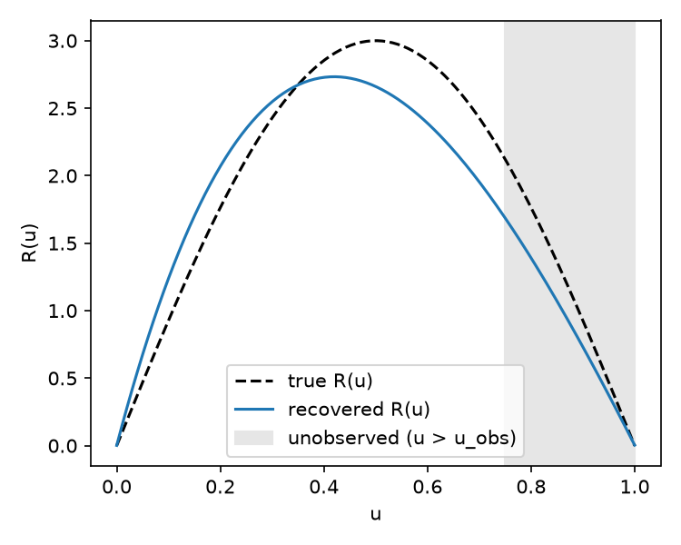

# Gray-box term discovery

This example recovers an unknown term in a PDE instead of an unknown coefficient.

The equation is a 1D reaction-diffusion problem

    u_t = D u_xx + R(u)

where `D u_xx` is known but the reaction term `R(u)` is not. Instead of fixing
its form, a second network maps `u -> R` and is trained jointly with the field
network `u(x, t)` from point observations of `u`. After training, `R` can be read
off and, if desired, fit to a closed form.

The reaction term used to generate the data is `R(u) = 3 sin(pi u)`, which is not
a polynomial, and the observations only cover `u <= 0.75`. That makes `R`
under-determined near `u = 1`. A physics prior — `u = 0` and `u = 1` are known
equilibria, so `R = 0` there — is added as a constraint on the reaction network.
It pins the closure in the unobserved region.

## Run

    python generate_data.py          # writes graybox_data.npz
    python graybox_reaction_diffusion.py

## How it works

- `GrayBoxReactionDiffusion` declares the residual in SymPy with `R` left as a
  function supplied at run time (`u_t - D u_xx - R`).
- A `PhysicsInformer` evaluates the residual: it auto-differentiates `u` with
  respect to `x` (via `grad_method="autodiff"`), while `u_t` is computed
  directly with `torch.autograd.grad` and passed in alongside `R` (autodiff
  spatial gradients only cover `x`/`y`/`z`, so the time derivative is supplied
  manually).
- `r_net` maps `u -> R`; it is called on the same collocation batch used for
  the residual, so gradients from the physics loss reach both `u_net` and
  `r_net` -- the residual jointly regularizes the field fit and the unknown
  closure.
- The equilibrium prior is a direct penalty, `mean(r_net([[0],[1]]) ** 2)`,
  added to the loss with its own weight (`loss_weights.equilibria` in
  `conf/config.yaml`).

After training, the script evaluates `r_net` on a `u` grid, compares it to the
true `R(u) = A sin(pi u)`, and saves the comparison to `recovered_R.png`:

The recovered closure tracks the true one well past `u_obs = 0.75`, the edge of
the observed range (shaded) -- the equilibria prior is what pins it down there,
since the PDE residual alone is satisfied by many closures in that region.

A standalone numpy reproduction of the mechanism (no PhysicsNeMo required) is in
`graybox_reference.py`, and the accompanying `test_graybox_verifiers.py` checks
that the prior reduces the spread of the recovered closure in the unobserved
region.
