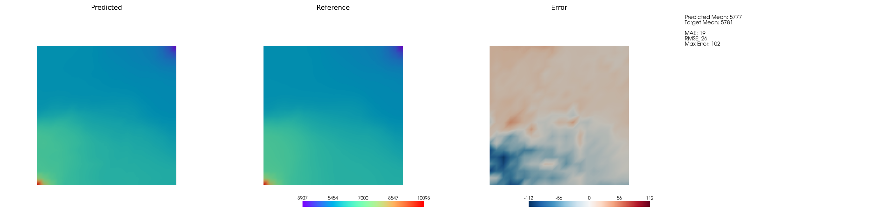
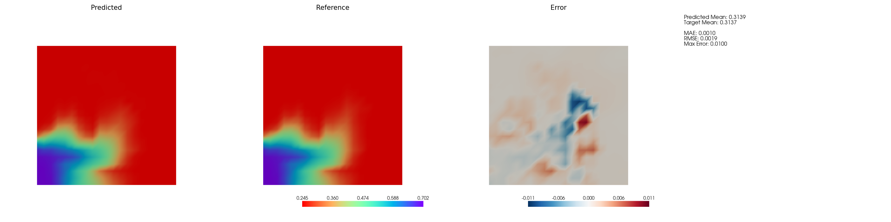

# XMeshGraphNet for Reservoir Simulation

An example for surrogate modeling using
[X-MeshGraphNet](https://arxiv.org/pdf/2411.17164) on reservoir simulation
dataset.

## Quick Start

### Prerequisites

**Python Version**: Python 3.10 or higher (tested with Python 3.10 and 3.11)

**Install Dependencies**:

```bash
pip install -r requirements.txt
```

### 0. Dataset Preparation

You need to provide reservoir simulation data in ECLIPSE/IX format to use this
example.

#### Option 1: Use Your Own Simulation Data

If you have your own reservoir simulation dataset, ensure all simulation cases
are stored in a single directory with ECLIPSE/IX style output files:

```text
your_dataset/
├── CASE_1.DATA
├── CASE_1.INIT
├── CASE_1.EGRID
├── CASE_1.UNRST
├── CASE_2.DATA
├── CASE_2.INIT
└── ... (multiple cases)
```

#### Option 2: Generate Sample Data (Example)

**Note**: A downloadable sample dataset will be made available in the future.

#### Expected Data Format

- **Format**: ECLIPSE/IX compatible binary files
- **Required files per case**: `.INIT`, `.EGRID`, `.UNRST`
- **Storage**: All cases in a single directory

### 1. Data Preprocessing

Prepare simulation results/ensembles under `dataset.sim_dir` in the
configuration file (`conf/config.yaml`), then run:

```bash
python src/preprocessor.py
```

**What it does**:

- Reads simulation binary files (`.INIT`, `.EGRID`, `.UNRST`) using
  `sim_utils`
- Extracts variables specified in the configuration file e.g., `config/config.yaml`
- Builds graph structures with nodes (grid cells) and edges (connections)
- Creates autoregressive training sequences for next-timestep prediction
- Saves processed graphs

### 2. Training

Multi-GPU training is supported:

```bash
torchrun --nproc_per_node=4 --nnodes=1 src/train.py
```

### 3. Inference and Visualization

Run autoregressive inference to predict future timesteps:

```bash
# Single GPU
python src/inference.py

# Multi-GPU (single node)
torchrun --nproc_per_node=2 src/inference.py
```

## Results and Visualizations

### Example Blind Test Results


*Pressure field comparison*


*Water saturation field comparison*

## Experiment Tracking

Launch MLflow UI to monitor training progress:

```bash
cd output/<your_experiment_name>
mlflow ui --host 0.0.0.0 --port 5000
```

Access the dashboard at: <http://localhost:5000>

## Planned Enhancements

- Application to large scale reservoir models

## References

- [X-MeshGraphNet: Scalable Multi-Scale Graph Neural Networks for Physics
  Simulation](https://arxiv.org/pdf/2411.17164)
