# XMeshGraphNet for Reservoir Simulation

An example for surrogate modeling using
[X-MeshGraphNet](https://arxiv.org/pdf/2411.17164) on reservoir simulation
datasets.

## Overview

Reservoir simulation is the process of replicating and predicting reservoir
performance by building physical and mathematical models. It utilizes
static and dynamic data from various sources to evaluate and optimize reservoir
development plans.

Modern reservoir simulation employs complex gridding techniques to capture
geologic structures and fractures, while solving highly nonlinear PDEs
governing multi-phase/component flow and transport. Despite advances in
numerical solvers and parallel computing (HPC and GPU acceleration), simulations
remain computationally expensive. This creates a critical need for faster
surrogate models when exploring large uncertainty spaces.

XMeshGraphNet (X-MGN) is naturally compatible with the finite volume framework
used in reservoir simulation and is scalable to industry-scale reservoir
models, making it an ideal surrogate modeling approach for this domain.

## Quick Start

### Prerequisites

**Python Version**: Python 3.10 or higher (tested with Python 3.10 and 3.11)

**Install Dependencies**:

```bash
pip install -r requirements.txt
```

### 0. Dataset Preparation

You need to provide reservoir simulation data in ECLIPSE/IX format to use this
example.

#### Option 1: Use Your Own Simulation Data

If you have your own reservoir simulation dataset, ensure all simulation cases
are stored in a single directory with ECLIPSE/IX style output files:

```text
<your-dataset>/
├── CASE_1.DATA
├── CASE_1.INIT
├── CASE_1.EGRID
├── CASE_1.UNRST
├── CASE_2.DATA
├── CASE_2.INIT
└── ... (multiple cases)
```

#### Option 2: Sample Data

**Note**: A downloadable sample dataset will be made available soon.

- Example 1: Waterflood in a 2D quarter five-spot model with varying
  permeability distributions generated using a geostatistical method
  (1000 samples).
- Example 2: Based on the publicly available
  [Norne Field](https://github.com/OPM/opm-data/tree/master/norne) dataset.
  A Design of Experiment and sensitivity study identified fault
  transmissibility and KVKH multipliers as key variables, which were then
  varied using Latin Hypercube Sampling to generate 500 samples. This
  well-known model contains numerous faults represented by Non-Neighbor
  Connections (NNCs), which X-MeshGraphNet naturally handles through its
  graph structure.

An open-source reservoir simulator, [OPM](https://opm-project.org/), was used
to generate both datasets.

#### Expected Data Format

- **Format**: ECLIPSE/IX compatible binary files
- **Required files per case**: `.INIT`, `.EGRID`, `.UNRST`
- **Storage**: All cases in a single directory

#### Example Visualization: Norne Field

Static reservoir property and domain partitions:

<!-- markdownlint-disable MD033 -->
<table>
<tr>
<td>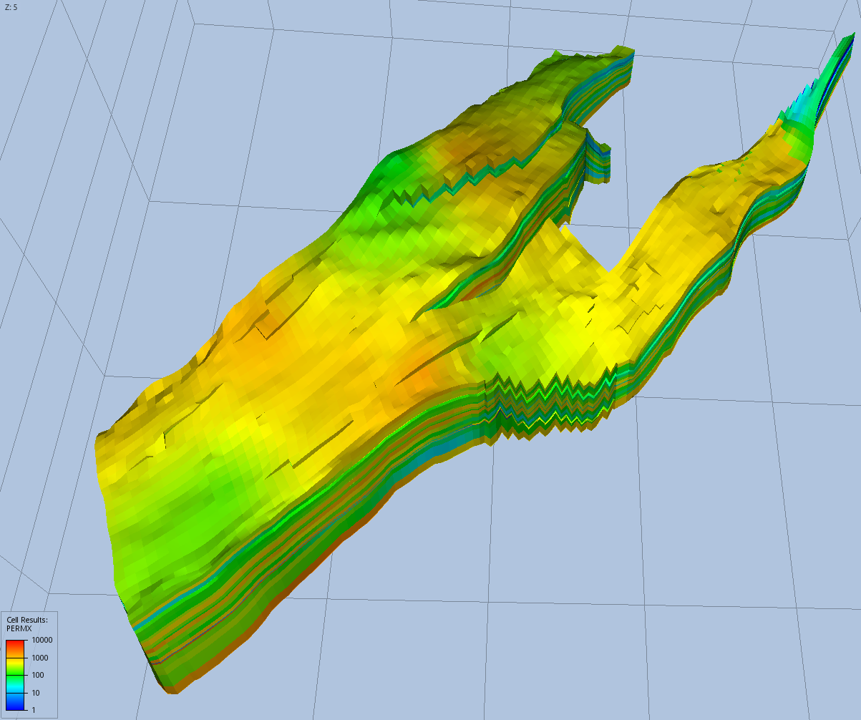</td>
<td>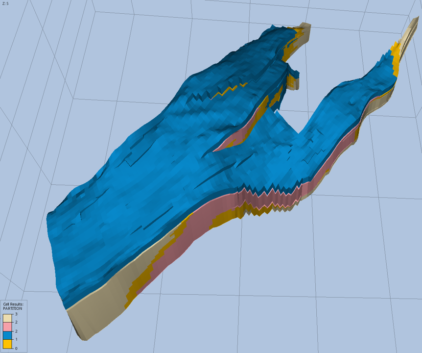</td>
</tr>
<tr>
<td align="center"><i>Permeability (PERMX) distribution</i></td>
<td align="center"><i>X-MeshGraphNet partitioning (0=halo region)</i></td>
</tr>
</table>
<!-- markdownlint-enable MD033 -->

### 1. Data Preprocessing

Configure your dataset path in `conf/<your-config>.yaml` by setting
`dataset.sim_dir` to point to your simulation data directory, then run:

```bash
python src/preprocessor.py --config-name=<your-config>
```

**Note:** Replace `<your-config>` with your configuration file name from the
`conf/` directory (without the `.yaml` extension). For example, use `config`
for `conf/config.yaml`. Use the same config name for training and inference
steps below.

**What it does**:

- Reads simulation binary files (`.INIT`, `.EGRID`, `.UNRST`) using
  `sim_utils`
- Extracts variables specified in the configuration file
- Builds graph structures with nodes (grid cells) and edges (connections)
- Creates autoregressive training sequences for next-timestep prediction
- Saves processed graphs

### 2. Training

Multi-GPU training is supported:

```bash
torchrun --nproc_per_node=4 --nnodes=1 src/train.py --config-name=<your-config>
```

### 3. Inference and Visualization

Run autoregressive inference to predict future timesteps:

```bash
python src/inference.py --config-name=<your-config>
```

**Output Location:** Results are saved to
`outputs/<your-experiment-name>/inference/`

**Output Files:**

- **HDF5 files**: Contain predictions and targets for each simulation case,
  organized by timestep and variable
- **GRDECL files**: Eclipse-compatible ASCII format that can be imported into
  popular software such as Petrel and [ResInsight](https://resinsight.org/)
  for visualization

#### Example Results: Autoregressive Inference

Water saturation and pressure predictions for the Norne field
across 64 timesteps spanning 10 years of operation with varying well controls,
including open/shut-in events. Such complex operational scenarios are often
challenging to capture with ML models. Nonetheless, X-MGN demonstrates good
predictability, especially for near-term predictions. As expected for
autoregressive prediction, errors accumulate over time, but the model maintains
reasonable accuracy throughout:

<!-- markdownlint-disable MD033 MD036 -->

**Pressure**

<table>
<tr>
<td></td>
<td align="center"><b>Timestep 21</b></td>
<td align="center"><b>Timestep 42</b></td>
</tr>
<tr>
<td align="center"><b>Ground Truth</b></td>
<td>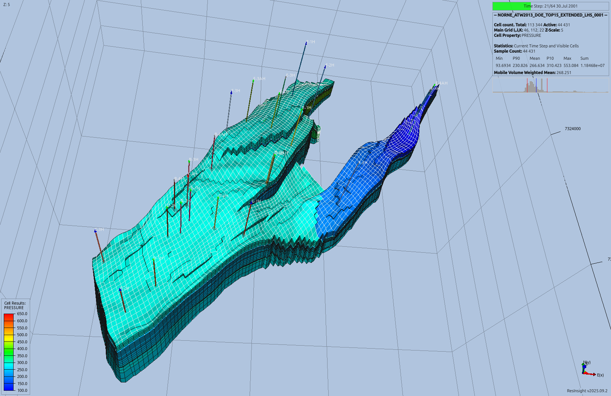</td>
<td>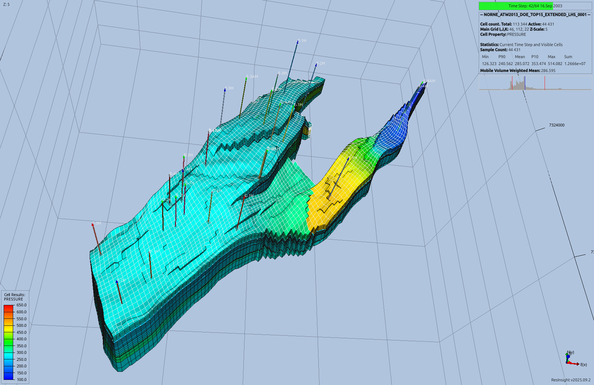</td>
</tr>
<tr>
<td align="center"><b>X-MGN Prediction</b></td>
<td>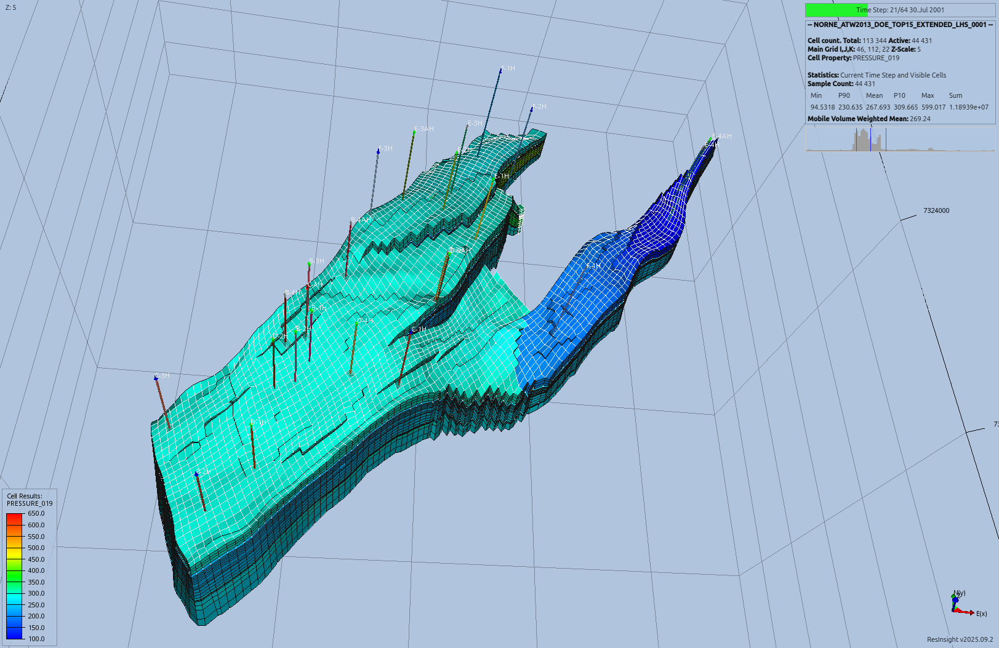</td>
<td>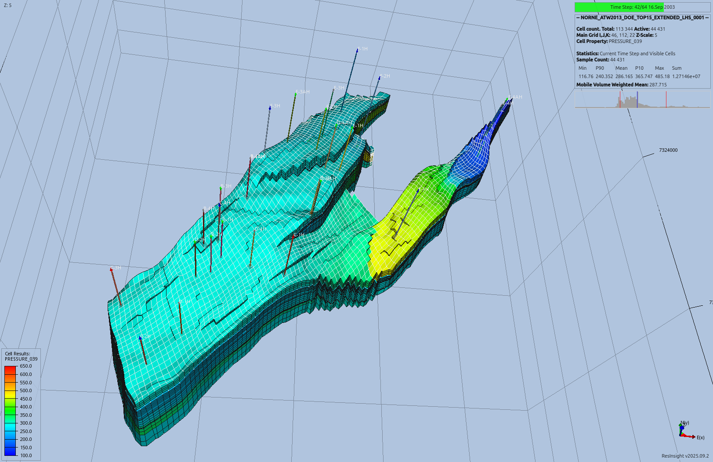</td>
</tr>
<tr>
<td align="center"><b>Prediction Error</b></td>
<td>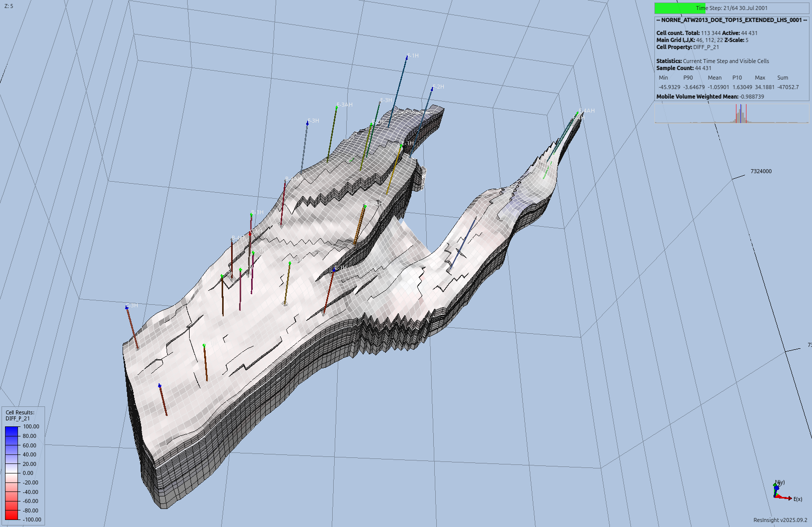</td>
<td>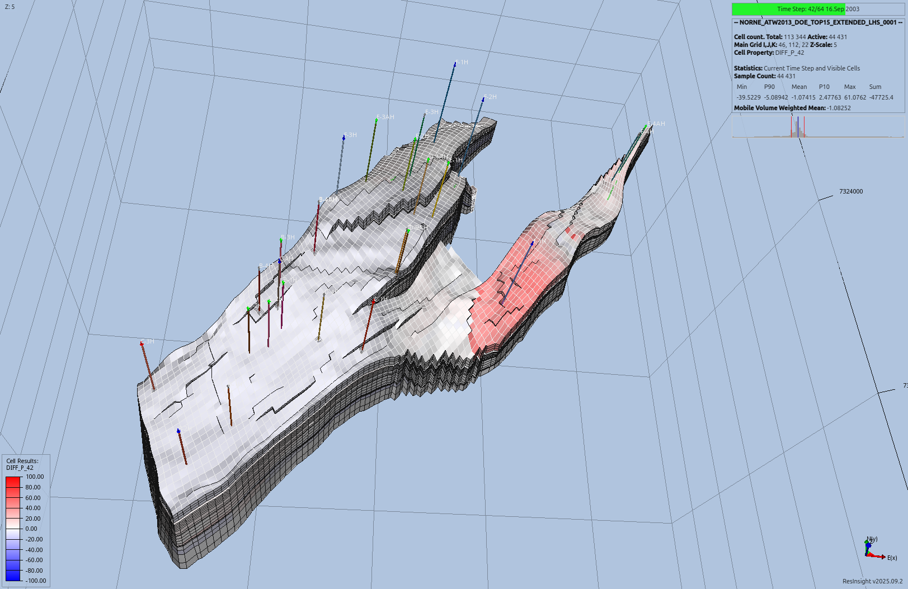</td>
</tr>
</table>

**Water Saturation**

<table>
<tr>
<td></td>
<td align="center"><b>Timestep 21</b></td>
<td align="center"><b>Timestep 42</b></td>
</tr>
<tr>
<td align="center"><b>Ground Truth</b></td>
<td></td>
<td></td>
</tr>
<tr>
<td align="center"><b>X-MGN Prediction</b></td>
<td>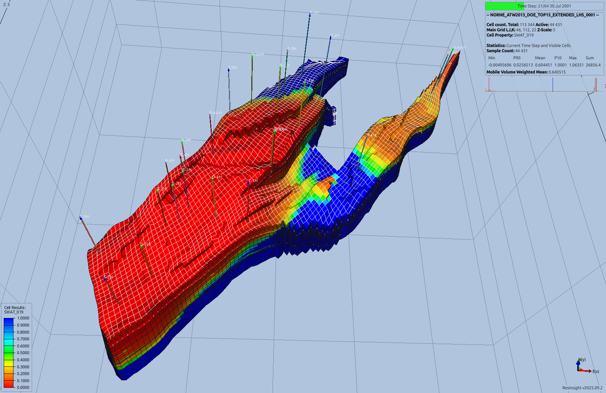</td>
<td>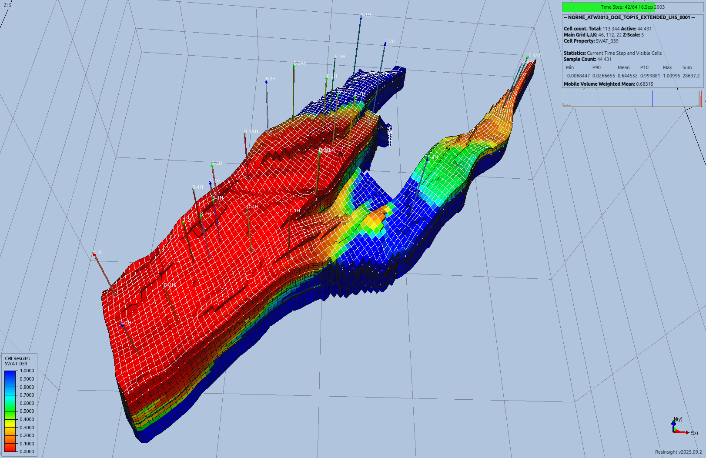</td>
</tr>
<tr>
<td align="center"><b>Prediction Error</b></td>
<td>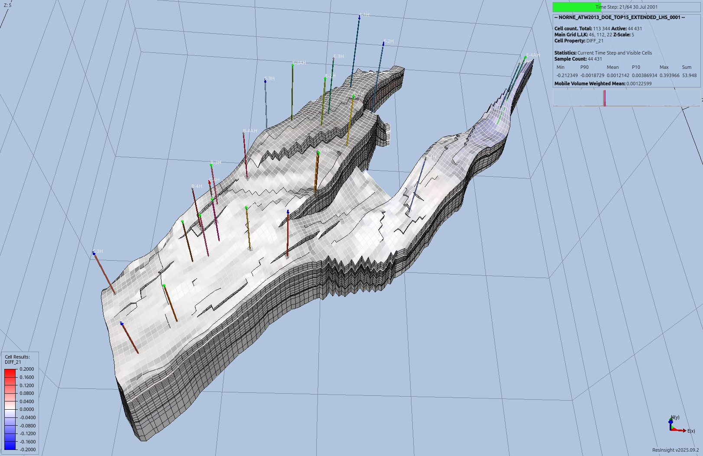</td>
<td>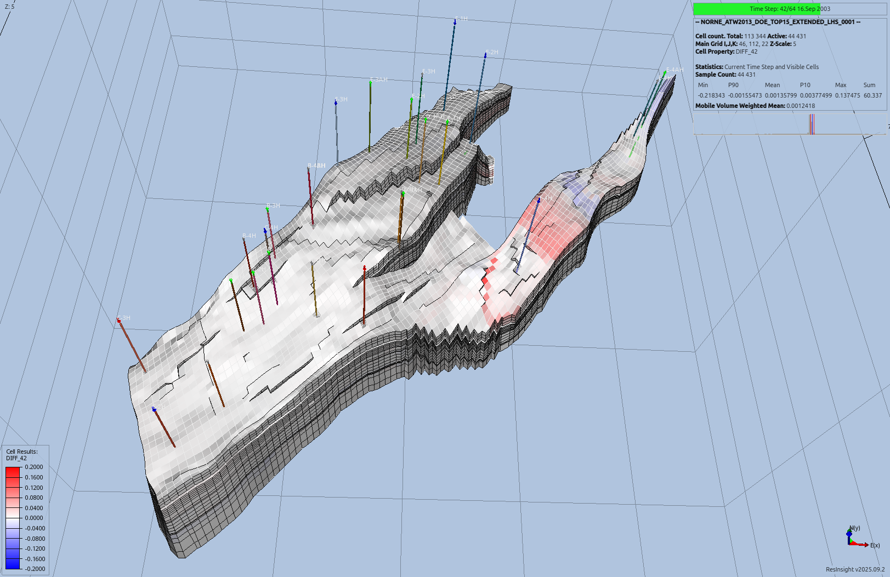</td>
</tr>
</table>

<!-- markdownlint-enable MD033 MD036 -->

## Experiment Tracking

Launch MLflow UI to monitor training progress (replace `<your-experiment-name>`
with your experiment name from the config):

```bash
cd outputs/<your-experiment-name>
mlflow ui --host 0.0.0.0 --port 5000
```

Access the dashboard at: <http://localhost:5000>

## References

- [X-MeshGraphNet: Scalable Multi-Scale Graph Neural Networks for Physics
  Simulation](https://arxiv.org/pdf/2411.17164)
- [Open Porous Media (OPM) Flow Simulator](https://opm-project.org/)
