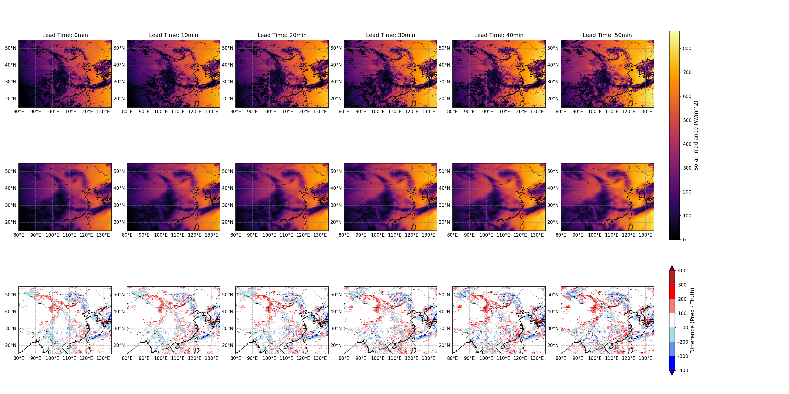
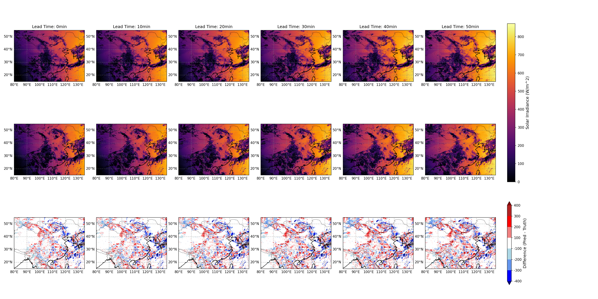

### **CorrDiffSolar**

CorrDiffSolar is a generative model for high-resolution solar irradiance downscaling. It utilizes a two-stage approach to upscale low-resolution ERA5 reanalysis data to high-resolution Shortwave Downward Radiation (SWDR) fields.

The process involves:
1.  A **Regression Model** to generate a base downscaled prediction.
2.  A **Diffusion Model** to learn and add high-frequency details by correcting the residual of the initial prediction.

This guide covers the entire workflow, including data preparation, environment setup, model training, and inference.

---

### **1. Project Overview**

The project consists of the following core components:

*   **Data Preprocessing Scripts**: Convert raw ERA5 and Himawari-8 data into a model-ready format.
*   **SolarDataset Class**: A custom PyTorch Dataset for efficiently loading and processing paired high- and low-resolution data.
*   **Regression Model**: A UNet-based model that performs the initial coarse downscaling.
*   **Diffusion Model**: A conditional diffusion model that refines the regression output, adding realistic, high-resolution details.
*   **MultiDiffusion Sampling**: A sliding-window inference strategy that enables the generation of large, high-resolution images while overcoming GPU memory limitations.

---

### **2. Environment Setup**

For a seamless setup, it is recommended to use the official PhysicsNeMo Docker container, which includes all necessary dependencies. Please ensure you have pulled the latest image and started the container before proceeding.

---

### **3. Data Preparation**

This model requires two primary data sources: low-resolution ERA5 data and high-resolution Himawari-8 SWDR data. Please download the raw data before following the instructions below.

#### **Raw Data Sources**

*   **Low-Resolution Input Data (ERA5):**
    *   **Source**: ERA5 Reanalysis (0.25-degree, 1-hour resolution)
    *   **Time Range**: 2016-2020
    *   **Path**: `path/to/ERA5/rawdata`
    *   **Variables**:
        *   `ssrd` (Surface Solar Radiation Downwards), `t2m` (2-meter Temperature), `tcwv` (Total Column Water Vapour)
        *   `t`, `q`, `z` (Temperature, Specific Humidity, Geopotential) at pressure levels: 50, 100, 300, 500, 925, 1000 hPa

*   **High-Resolution Target Data (Himawari-8):**
    *   **Source**: Himawari-8 (H08) L3 Hourly Surface Solar Radiation Product for China and Surrounding Areas (0.05-degree, 10-minute resolution). Available [here](https://data.tpdc.ac.cn/en/data/4c4fbfa7-b165-48db-8525-0d1c165b39c4).
    *   **Time Range**: 2016-2020
    *   **Path**: `path/to/H08/rawdata`
    *   **Variable**: `SWDR`

#### **3.1. Preparing High-Resolution (HR) Data**

1.  **Organize Raw Data**: Place the downloaded 10-minute interval `_SWDR.nc` files into a directory structure of `YEAR/YYYYMM/DD/`.
2.  **Run Preprocessing Script**:
    *   Modify the `data_directory` variable in `prepare_solar_data/prepare_h08_hourly.py` to point to your raw H08 data root.
    *   Execute the script. It will automatically merge the six 10-minute files for each hour, crop them to the target domain, filter out missing and nighttime data, and save the results into the `HRdata/H08_YYYY_hourly/` directory.

#### **3.2. Preparing Low-Resolution (LR) Data**

1.  **Organize Raw Data**: Store the annual ERA5 data in separate `.nc` files for each variable (e.g., `2016_2m_temperature.nc`, `2016_q_500.nc`).
2.  **Run Preprocessing Script**:
    *   Open `prepare_solar_data/prepare_era5.py`.
    *   Modify the `path` variable to point to the directory containing your annual ERA5 `.nc` files.
    *   Modify the `output_filename` variable to specify the output path for the Zarr archives (`LRdata/`).
    *   Execute the script to generate an `era5_YYYY_opt.zarr` file for each year.

#### **3.3. Preparing Static Files**

1.  **dem.nc**: Go to `prepare_solar_data/get_dem` directory. Run the `1-download.sh` and `2-outputDEM` script to download, interpolate, crop, save, and visualize the DEM file over interested region.
2.  **stats.json**: This file contains normalization statistics (mean, std, etc.) for all variables. Run `prepare_solar_data/get_stats.py` to compute these statistics from your training data.


After completing the above preprocessing steps, your final data directory should have the following structure:

```
/path/to/your/data/
├── HRdata/
│   ├── H08_2016_hourly/
│   │   ├── H08_20160101_0000_hourly.nc
│   │   └── ...
│   ├── H08_2017_hourly/
│   └── ...
├── LRdata/
│   ├── era5_2016_opt.zarr/
│   ├── era5_2017_opt.zarr/
│   └── ...
├── dem.nc
└── stats.json
```
---

### **4. Model Training**

The training is a two-stage process. Use Hydra to launch training from the command line. During training, we obtain the window data with fixed size 320x320 via randomly sampling.

#### **Stage 1: Train the Regression Model**

This stage trains the base UNet for initial downscaling.

1.  **Configuration**: `config_training_multidiffsolar_regression.yaml`
2.  **Modify Config**:
    *   Set `dataset.data_path` to your final data root directory (`/path/to/your/data/`).
    *   Ensure `dataset.stats_path` points to your `stats.json` file.
    *   Adjust `training.hp.total_batch_size` and `training.hp.batch_size_per_gpu` based on your hardware.
3.  **Launch Training**:
    *   For single-GPU training:
        ```bash
        python train.py --config-name=config_training_multidiffsolar_regression.yaml
        ```
    *   For multi-GPU training:
        ```bash
        torchrun --standalone --nnodes=1 --nproc_per_node=8 train.py --config-name=config_training_multidiffsolar_regression.yaml
        ```
    Checkpoints will be saved in the directory specified by Hydra (e.g., `outputs/solar_regression/`).

#### **Stage 2: Train the Diffusion Model**

This stage trains the residual diffusion model, conditioned on the pre-trained regression model.

1.  **Configuration**: `config_training_multidiffsolar_diffusion.yaml`
2.  **Modify Config**:
    *   Verify `data_path` and `stats_path` as in Stage 1.
    *   **Crucial Step**: In the `training.io` section, set `regression_checkpoint_path` to the path of a regression model checkpoint (`.pt`) from Stage 1.
3.  **Launch Training**:
    *   For single-GPU or multi-GPU training, use the same commands as above but with the new config file:
        ```bash
        torchrun --standalone --nnodes=1 --nproc_per_node=8 train.py --config-name=config_training_multidiffsolar_diffusion.yaml
        ```
    Checkpoints will be saved in the corresponding output directory.

---

### **5. Model Inference**

Inference can be performed with or without the diffusion model refinement.

#### **Mode 1: Regression-Only Inference**

This mode is faster and provides a good baseline result.

1.  **Configuration**: `config_generate_multidiffsolar.yaml`
2.  **Modify Config**:
    *   Ensure `data_path` and `stats_path` are correct.
    *   In the `inference` section, set `regression_checkpoint_path` to point to your chosen regression model checkpoint.
3.  **Launch Inference**:
    ```bash
    python test.py --config-name=config_generate_multidiffsolar.yaml
    ```

#### **Mode 2: Full CorrDiffSolar Inference (Regression + Diffusion)**

This mode produces the highest quality results by applying the full two-stage model.

1.  **Configuration**: `config_generate_multidiffsolar_wDiff.yaml`
2.  **Modify Config**:
    *   Check `data_path` and `stats_path`.
    *   **Crucial Step**: Set both `regression_checkpoint_path` and `diffusion_checkpoint_path` in the `inference` section.
3.  **Launch Inference**:
    ```bash
    python test.py --config-name=config_generate_multidiffsolar_wDiff.yaml
    ```
    Generated predictions will be saved in the output directory specified by Hydra.

---

### **6. Code Structure Overview**

*   **`SolarDataset` Class**: The core data loader. Its `_get_files_stats` method scans data directories, while `__getitem__` fetches, interpolates, normalizes, computes the solar zenith angles, and crops data samples.
*   **`MultiDiffusion` Class**: The sampler used during inference, located in `helpers/generate_helpers.py`. It implements a sliding-window (patch-based) approach to apply the diffusion model across large images, seamlessly stitching the results by averaging overlapping regions.
*   **`generate_solar` function**: The function located in `helpers/generate_helpers.py` performs the inference.

---

### **7. Visualization Example**

Use the provided `plot.py` script to visualize the generated outputs against the ground truth.




