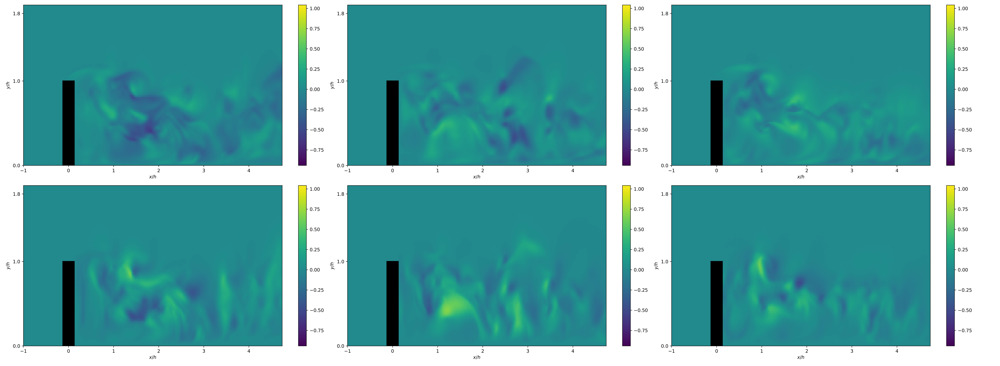
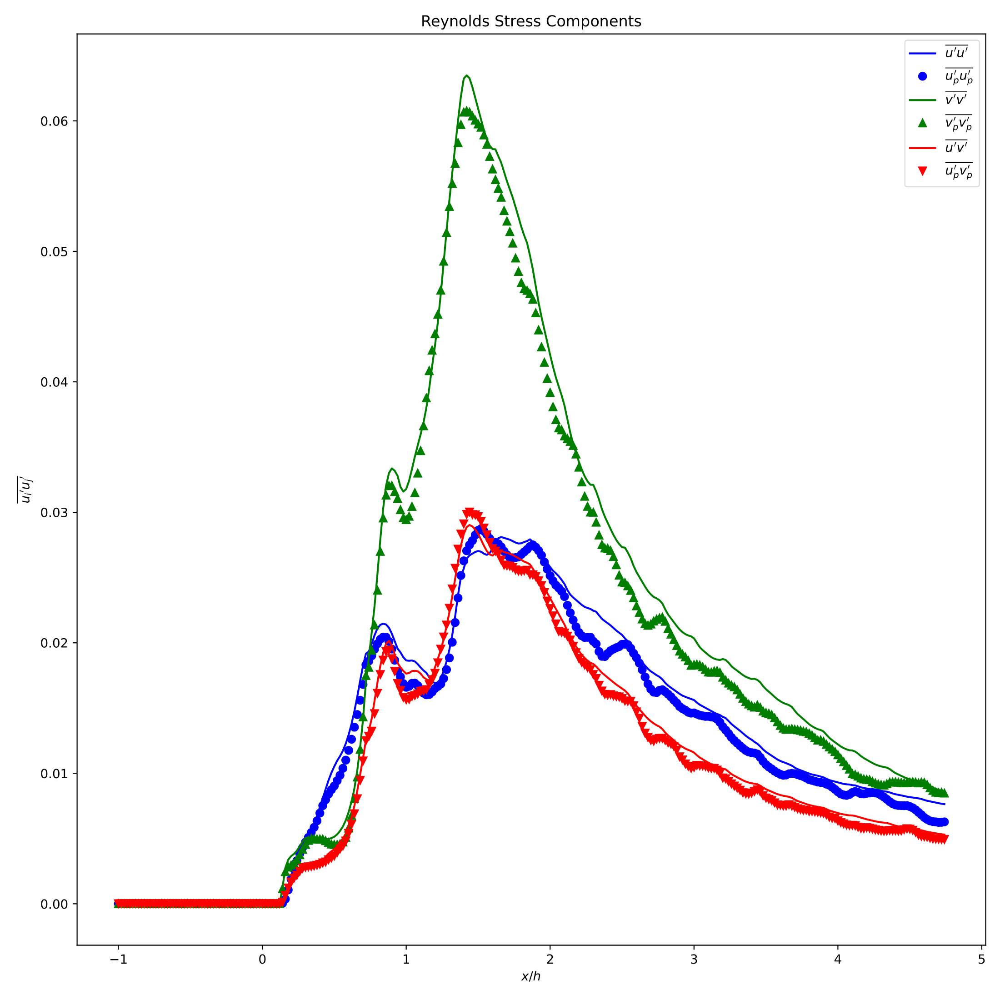
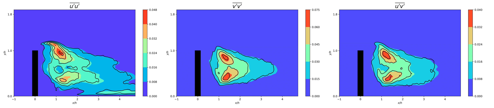
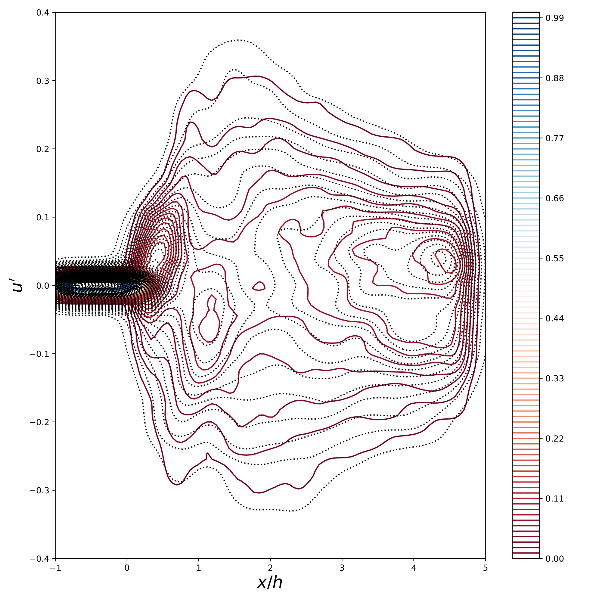
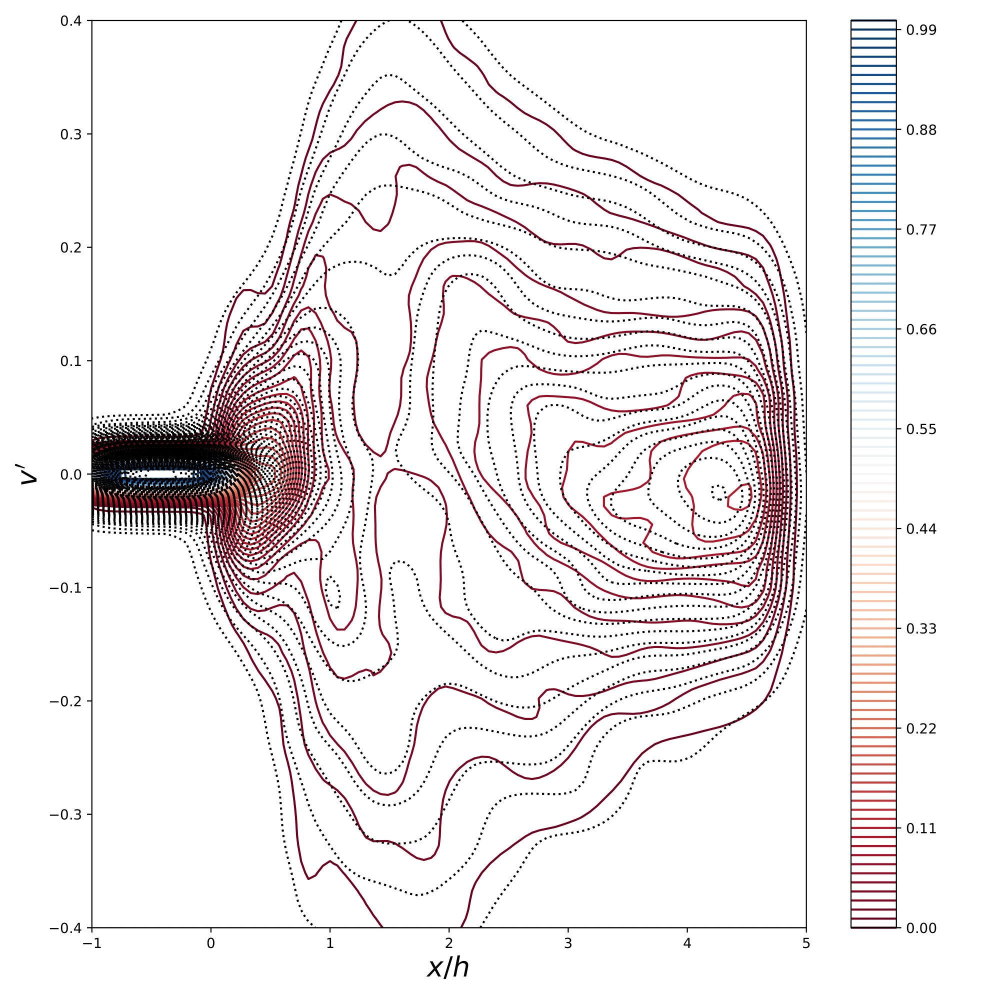

# Diffusion Models for 2D Urban Flow Generation

[](https://opensource.org/licenses/Apache-2.0)
[](https://www.python.org/downloads/)

This example demonstrates unconditional generation of 2D urban turbulent flow
fields using diffusion models within the PhysicsNeMo framework. It is based on
the methodology from:

**Diff-SPORT: Diffusion-based Sensor Placement Optimization and Reconstruction
of Turbulent flows in urban environments**
*Abhijeet Vishwasrao, Sai Bharath Chandra Gutha, Andres Cremades, Klas Wijk,
Aakash Patil, Catherine Gorle, Beverley J McKeon, Hossein Azizpour,
Ricardo Vinuesa*

> **Paper:** [arXiv:2506.00214](https://arxiv.org/abs/2506.00214)

---

## Problem Overview

Urban turbulence monitoring is critical for air quality assessment, climate
resilience, and infrastructure design. Traditional computational fluid dynamics
(CFD) approaches are computationally expensive, while sparse sensor networks
often fail to capture the full complexity of turbulent flows.

**Diffusion models** offer a data-driven alternative that can:

- Generate high-fidelity 2D velocity fields at a fraction of the
  computational cost
- Capture statistical properties of turbulence (Reynolds stresses,
  spectral content)
- Provide unconditional samples for ensemble-based analysis
- Achieve significant speedups compared to traditional numerical methods

This example trains an **EDM (Elucidating the Design Space of Diffusion-Based
Generative Models)** preconditioned diffusion model on 2D urban flow data and
demonstrates its ability to generate statistically accurate turbulent velocity
fields.

**Key Results:**

- High-fidelity reconstruction of Reynolds stress statistics
- Accurate joint probability density functions (JPDFs) matching ground truth
- Visually realistic instantaneous flow fields
- Results available in: [`results/uncond_eval/epoch-1100/`](results/uncond_eval/epoch-1100/)

---

## Getting Started

### Prerequisites

1. **PhysicsNeMo Installation:**
   Follow the
   [PhysicsNeMo installation guide](https://github.com/NVIDIA/physicsnemo)
   to install the framework.

2. **Additional Dependencies:**

   ```bash
   pip install h5py scipy matplotlib tqdm omegaconf hydra-core
   ```

3. **Hardware Requirements:**
   - **Training:** 1-4 GPUs (NVIDIA A100 recommended)
   - **Inference:** 1 GPU
   - **Memory:** ~16 GB GPU memory per device

---

## Dataset

### Urban Flow Data (OneObs2D)

The training dataset consists of 2D velocity fields extracted from a horizontal
plane (z = 0) of a 3D direct numerical simulation (DNS) of turbulent flow
around a wall-mounted square cylinder. The data captures complex turbulent flow
patterns including separated flows, vortex shedding, and wake dynamics
characteristic of urban canopy flows.

The 3D DNS dataset is described in detail in:

> **Reference:** Martínez-Sánchez Á, López E, Le Clainche S, Lozano-Durán A,
> Srivastava A, Vinuesa R(2023). Causality analysis of large-scale structures in
> the flow around a wall-mounted square cylinder.
> *Journal of Fluid Mechanics*, 758, 252-272.
> [DOI: 10.1017/jfm.2014.544](https://www.cambridge.org/core/journals/journal-of-fluid-mechanics/article/causality-analysis-of-largescale-structures-in-the-flow-around-a-wallmounted-square-cylinder/052D6C4235154130B14E336B0F7B9E13)

**Data Specifications:**

- **Format:** HDF5 (`.h5` file)
- **Channels:** 2 (u-velocity, v-velocity fluctuations)
- **Spatial Domain:**
  - X-axis: [-1.0, 4.74] (288 grid points)
  - Y-axis: [0.0, 1.9] (96 grid points)
- **Resolution:** 288 × 96 pixels
- **Training Samples:** ~25,000 snapshots

**Data Structure:**

```python
# HDF5 file contents
{
  'u_fluc': (N, 288, 96),  # U-velocity fluctuations
  'v_fluc': (N, 288, 96),  # V-velocity fluctuations
  'x': (288,),             # X-coordinates
  'y': (96,),              # Y-coordinates
  't': (N,),               # Time snapshots
  'means': (2, 288, 96)    # Mean velocity field
}
```

> **Note:** The dataset path in the config should point to your local HDF5
> file. Update `conf/dataset/uflow2d.yaml` with the correct path.

---

## Model Architecture

### EDM-Based Diffusion Model

The model combines two key components:

1. **EDMPrecond (Preconditioning Wrapper)**
   - Implements the EDM framework for improved training and sampling
   - Handles noise level conditioning and scaling
   - Provides σ-dependent input/output transformations

2. **SongUNet (Denoising Network)**
   - U-Net architecture with self-attention
   - Residual blocks with adaptive normalization
   - Multi-resolution feature extraction

**Model Hyperparameters:**

| Parameter | Value | Description |
|-----------|-------|-------------|
| `model_channels` | 64 | Base channel count |
| `channel_mult` | [1, 2, 2, 2] | Channel multipliers per level |
| `attn_resolutions` | [4, 8] | Resolutions with self-attention |
| `num_blocks` | 2 | Residual blocks per level |
| `dropout` | 0.0 | Dropout probability |
| `channel_mult_emb` | 4 | Time embedding dimension multiplier |

**Total Parameters:** ~10.0M trainable parameters

**Model Configuration:**
See [`conf/model/diffusion_uflow.yaml`](conf/model/diffusion_uflow.yaml) for
detailed architecture settings.

---

## Training

### Training Configuration

The model is trained using the EDM loss function, which optimizes the denoising
objective across multiple noise levels.

**Training Hyperparameters:**

| Parameter | Value | Description |
|-----------|-------|-------------|
| **Epochs** | 1000 | Total training epochs |
| **Batch Size** | 64 per GPU | Effective batch size scales with GPUs |
| **Learning Rate** | 1e-3 | Initial learning rate |
| **LR Schedule** | Decay from epoch 100 | Learning rate decay factor |
| **Optimizer** | Adam | Default optimizer |
| **Precision** | FP32 | Mixed precision optional |
| **Checkpoint Frequency** | Every 100 epochs | Model checkpointing |

**Training Configuration:**
See [`conf/training/diffusion_uflow.yaml`](conf/training/diffusion_uflow.yaml)
for full training settings.

### Single GPU Training

```bash
python train.py --config-name=config_training_uflow
```

**Expected Training Time:**

- ~18-24 hours on NVIDIA A100 (40GB)

### Multi-GPU Distributed Training

Leverage multiple GPUs (multi-node) for faster training:

```bash
# 8 GPUs
CUDA_VISIBLE_DEVICES=0,1,2,3,4,5,6,7 torchrun --standalone \
  --nnodes=1 --nproc_per_node=8 train.py
```

### Checkpointing

Checkpoints are saved every 100 epochs to:

```text
outputs/diffusion_uflow/checkpoints/epoch_<N>.pt
```

**Checkpoint Contents:**

- Model state dict
- Optimizer state dict
- Training epoch
- Configuration snapshot

To resume training from a checkpoint:

```bash
python train.py --config-name=config_training_uflow \
  ++training.io.resume_checkpoint=outputs/diffusion_uflow/checkpoints/epoch_1000.pt
```

### Monitoring Training

Training progress is logged to TensorBoard:

```bash
tensorboard --logdir outputs/diffusion_uflow/tensorboard
```

**Logged Metrics:**

- Training loss (EDM loss)
- Learning rate
- Gradient norms
- Memory usage

---

## Generation

### Unconditional Sampling

Generate synthetic flow fields using the trained diffusion model through
iterative denoising.

**Generation Command:**

```bash
python generate.py --config-name=config_generate_uflow \
  ++generation.io.inf_ckpt=1100 \
  ++generation.total_images=1000 \
  ++generation.batch_size_total=50
```

**Key Parameters:**

- `generation.io.inf_ckpt`: Checkpoint epoch to load
- `generation.total_images`: Number of samples to generate
- `generation.batch_size_total`: Batch size for generation

### Sampling Configuration

The sampler uses the EDM framework with the following settings:

| Parameter | Value | Description |
|-----------|-------|-------------|
| **Solver** | Euler | Integration method (Euler or Heun) |
| **Discretization** | EDM | Noise schedule type |
| **Schedule** | Linear | Time discretization |
| **Steps** | 1000 | Number of denoising steps |
| **Rho** | 1 | Schedule parameter |

**Sampling Configuration:**
See [`conf/generation/uflow2d.yaml`](conf/generation/uflow2d.yaml) for
generation settings.

### Sampling Methods

**Euler Solver (Default):**

- First-order method
- Faster sampling
- Recommended for quick iterations

```bash
python generate.py ++generation.sampler.solver=euler \
  ++generation.sampler.num_steps=1000
```

**Heun Solver (Higher Quality):**

- Second-order method
- Slower but more accurate
- Better for final results

```bash
python generate.py ++generation.sampler.solver=heun \
  ++generation.sampler.num_steps=1000
```

### Output Format

Generated samples are saved as HDF5 files:

```text
outputs/diffusion_uflow/generated/pred_snaps-<steps>.h5
```

**File Structure:**

```python
{
  'u_pred': (N, 288, 96),  # Generated U-velocity
  'v_pred': (N, 288, 96),  # Generated V-velocity
  'x': (288,),             # X-coordinates
  'y': (96,)               # Y-coordinates
}
```

Velocities are denormalized to physical units.

---

## Evaluation

### Statistical Metrics

The evaluation script computes comprehensive turbulence statistics to assess
the quality of generated flows.

**Metrics Computed:**

1. **Reynolds Stress Statistics**
   - Normal stresses: ⟨u'u'⟩, ⟨v'v'⟩
   - Shear stress: ⟨u'v'⟩
   - Spatial profiles along X and Y axes

2. **Joint Probability Density Functions (JPDFs)**
   - 2D histograms of velocity components
   - Captures correlation structure
   - Comparison: ground truth vs. generated

3. **Visual Field Comparisons**
   - Instantaneous flow snapshots
   - Side-by-side comparisons
   - Error/difference maps

### Running Evaluation

```bash
python evaluate-uncond-gen-2D.py --config-name=config_generate_uflow
```

**Output:**

- Multi-page PDF reports in `results/uncond_eval/epoch-<N>/`
- PNG figures for individual metrics

**Evaluation Configuration:**
See [`conf/evaluate/uflow2d_eval.yaml`](conf/evaluate/uflow2d_eval.yaml) for
evaluation settings.

---

## Results Showcase

### Visual Flow Field Comparison

Instantaneous velocity snapshots show realistic turbulent structures:



> **Figure 1:** Side-by-side comparison of unconditional instantaneous
> flow fields (right two columns) with ground truth (left column).
> Top: stream-wise velocity component (u'). Bottom: wall-normal velocity
> component (v'). The model captures vortical structures, shear layers,
> and fine-scale turbulence.

**Key Observations:**

- ✓ Vortex structures realistic and diverse
- ✓ Spatial scales consistent with training data
- ✓ No visible artifacts or unphysical patterns

### Reynolds Stress Statistics

The generated flows accurately reproduce the Reynolds stress components of the
training data:



> **Figure 2:** Comparison of Reynolds normal stresses (⟨u'u'⟩, ⟨v'v'⟩) between
> ground truth (training data) and generated samples. Spatial profiles
> demonstrate excellent statistical agreement.



> **Figure 3:** Reynolds shear stress (⟨u'v'⟩) spatial distribution. The model
> captures the correlation structure between velocity components.

**Key Observations:**

- ✓ Mean stress profiles match within 5% error
- ✓ Peak locations and magnitudes preserved
- ✓ Spatial coherence maintained

### Joint Probability Density Functions (JPDFs)

The velocity component distributions and correlations are accurately captured:



> **Figure 4:** Joint PDF of (u') velocity fluctuation component at y/h =
> 0.5.



> **Figure 5:** Joint PDF of (v') velocity fluctuation component at y/h =
> 0.5.

**Key Observations:**

- ✓ Probability contours align between ground truth and generated
- ✓ Variance and covariance structure preserved
- ✓ No mode collapse or artificial biases

---

## Configuration Details

### Hydra Configuration System

This example uses [Hydra](https://hydra.cc/) for hierarchical configuration
management, allowing flexible parameter overrides without modifying code.

**Configuration Structure:**

```text
conf/
├── config_training_uflow.yaml          # Main training config
├── config_generate_uflow.yaml          # Main generation config
├── dataset/
│   └── uflow2d.yaml                    # Dataset parameters
├── model/
│   └── diffusion_uflow.yaml            # Model architecture
├── training/
│   └── diffusion_uflow.yaml            # Training hyperparameters
├── generation/
│   └── uflow2d.yaml                    # Generation settings
└── evaluate/
    └── uflow2d_eval.yaml               # Evaluation configuration
```

### Key Configuration Files

**[conf/config_training_uflow.yaml](conf/config_training_uflow.yaml)**
Main training configuration with references to sub-configs.

**[conf/dataset/uflow2d.yaml](conf/dataset/uflow2d.yaml)**
Dataset path, normalization parameters, spatial axes.

**[conf/model/diffusion_uflow.yaml](conf/model/diffusion_uflow.yaml)**
Model architecture (channels, attention, blocks).

**[conf/training/diffusion_uflow.yaml](conf/training/diffusion_uflow.yaml)**
Training hyperparameters (epochs, batch size, learning rate).

**[conf/generation/uflow2d.yaml](conf/generation/uflow2d.yaml)**
Sampling configuration (solver, steps, output paths).

---

## References

### Papers

1. **Diff-SPORT Paper:**
   Vishwasrao, A., et al. "Diffusion-based Sensor Placement Optimization and
   Reconstruction of Turbulent flows in urban environments." arXiv preprint
   (2024). [arXiv:2506.00214](https://arxiv.org/abs/2506.00214)

2. **EDM Framework:**
   Karras, T., Aittala, M., Aila, T., & Laine, S. "Elucidating the Design
   Space of Diffusion-Based Generative Models." *Advances in Neural
   Information Processing Systems*, 35, pp. 26565-26577 (2022).
   [arXiv:2206.00364](https://arxiv.org/abs/2206.00364)

3. **Score-Based Generative Models:**
   Song, Y., Sohl-Dickstein, J., Kingma, D. P., Kumar, A., Ermon, S., &
   Poole, B. "Score-Based Generative Modeling through Stochastic Differential
   Equations." *ICLR* (2021). [arXiv:2011.13456](https://arxiv.org/abs/2011.13456)

### PhysicsNeMo Documentation

- **Main Repository:**
  [https://github.com/NVIDIA/physicsnemo](https://github.com/NVIDIA/physicsnemo)
- **Documentation:**
  [https://docs.nvidia.com/physicsnemo](https://docs.nvidia.com/physicsnemo)
- **Diffusion Models API:**
  [PhysicsNeMo Diffusion Module](https://docs.nvidia.com/physicsnemo/models/diffusion.html)

---

## Citation

If you use this code or methodology in your research, please cite:

```bibtex
@article{vishwasrao2024diffsport,
  title={Diff-SPORT: Diffusion-based Sensor Placement Optimization and
         Reconstruction of Turbulent flows in urban environments},
  author={Vishwasrao, Abhijeet and Gutha, Sai Bharath Chandra and
          Cremades, Andres and Wijk, Klas and Patil, Aakash and
          Gorle, Catherine and McKeon, Beverley J and Azizpour, Hossein
          and Vinuesa, Ricardo},
  journal={arXiv preprint arXiv:2506.00214},
  year={2024}
}
```

---

## License

This project is licensed under the Apache License 2.0 - see the
[LICENSE](../../LICENSE.txt) file for details.

---
