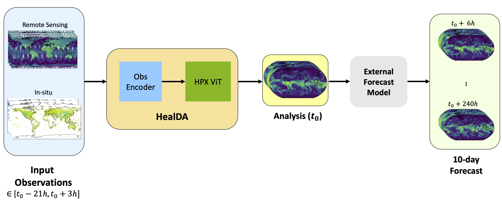

<!-- markdownlint-disable -->
# HealDA

<p align="center">

</p>
HealDA is a global data assimilation model.

This model is for research and development only.

[📖 arXiv](https://arxiv.org/abs/XXXX.XXXXX) · 📦 Checkpoints (coming soon) ·

---

## Setup

### Installation

```bash
# Install PhysicsNeMo
pip install nvidia-physicsnemo

# Install example dependencies
pip install -r requirements.txt
```

---

## Data Preparation

See [`datasets/da/v2/etl/`](datasets/da/v2/etl/) for ETL scripts to prepare observation data.

See [`datasets/da/preprocessing/`](datasets/da/preprocessing/) for normalization computation scripts.

---

## Training

```bash
python train.py --help
```

<!-- TODO: Add training examples -->

---

## Inference

```bash
python inference_da.py --help
```

<!-- TODO: Add inference examples -->

---

## Citation

```bibtex
@article{healda2025,
  title={HealDA},
  author={TODO},
  journal={arXiv preprint arXiv:XXXX.XXXXX},
  year={2025}
}
```
