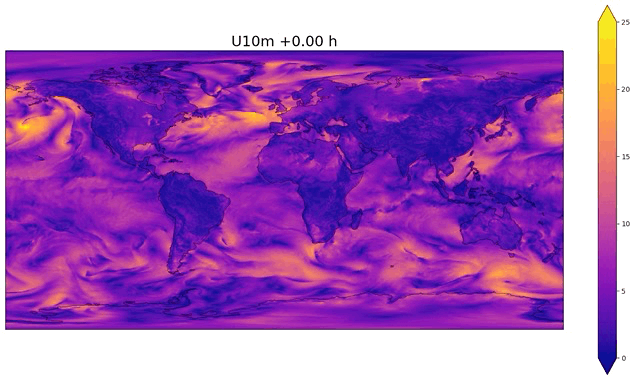

# Earth-2 Temporal Interpolation Model

The temporal interpolation model is used to increase the temporal resolution of AI-based
forecast models. These typically have a native temporal resolution of 6 hours; the
interpolation allows this to be improved to 1 hour. With appropriate training data, even
higher temporal resolutions should be achievable.

This PhysicsNeMo example shows how to train a ModAFNO-based temporal interpolation model
with a custom dataset. This architecture uses an embedding network to determine
parameters for a shift+scale operation that is used to modify the behavior of the AFNO
network depending on a given conditionning variable. In the case of temporal
interpolation, the atmospheric states at both ends of the interpolation interval are
passed as inputs along with some auxiliary data such as orography, and the conditioning
indicates which time step between the endpoints will be generated by the model. The
interpolation is deterministic and trained with latitude-weighted L2 loss. However, it
can still be used to produce probabilistic forecasts if used to interpolate results of
probabilistic forecast models.

For access to the pre-trained model, see the [wrapper in
Earth2Studio](https://nvidia.github.io/earth2studio/modules/generated/models/px/earth2studio.models.px.InterpModAFNO.html#earth2studio.models.px.InterpModAFNO).
A technical description of the model can be found in the paper ["Modulated Adaptive
Fourier Neural Operators for Temporal Interpolation of Weather
Forecasts"](https://arxiv.org/abs/2410.18904).



## Requirements

### Environment

You need to have PhysicsNeMo installed on a GPU system. Training useful models in
practice requires a multi-GPU system; for the original model, 64 H100 GPUs were used.
Using the [PhysicsNeMo
container](https://catalog.ngc.nvidia.com/orgs/nvidia/teams/physicsnemo/containers/physicsnemo)
is recommended.

Install additional packages (MLFlow) needed by this example:

```bash
pip install -r requirements.txt
```

### Data

To train a temporal interpolation model, you need the following:

* A dataset of yearly HDF5 files at 1-hour resolution. For more details, see the section
  ["Data Format and Structure" in the diagnostic model
  example](https://github.com/NVIDIA/physicsnemo/blob/5a64525c40eada2248cd3eacee0a6ac4735ae380/examples/weather/diagnostic/README.md#data-format-and-structure).
  These datasets can be very large: the dataset used to train the original model, with
  73 variables from 1980 to 2017, is approximately 100 TB in size. The data used to
  train the original model are on the ERA5 0.25 degree grid with shape `(721, 1440)` but
  other resolutions should work too.
* Statistics files containing the mean and standard deviation of each channel in the
  data files. They should be found in the `stats/global_means.npy` and
  `stats/global_stds.npy` files in your data directory. They should be `.npy` files
  containing a 1D array with length equal to the number of variables in the dataset,
  with each value giving the mean (for `global_means.npy`) or standard deviation (for
  `global_stds.npy`) of the corresponding variable.
* A JSON file with metadata about the contents of the HDF5 files. See [here](https://github.com/NVIDIA/physicsnemo/blob/main/examples/weather/temporal_interpolation/data.json)
  for an example describing the dataset used to train the original model.
* Optional: NetCDF4 files containing the orography and land-sea mask for the grid
  contained in the data. These should contain a variable of the same shape as the data

## Configuration

The model training is controlled by YAML configuration files managed by
[Hydra](https://hydra.cc/), found in the `config` directory. The full configuration for
training the original model is
[`train_interp.yaml`](https://github.com/NVIDIA/physicsnemo/blob/main/examples/weather/temporal_interpolation/config/train_interp.yaml).
[`train_interp_lite.yaml`](https://github.com/NVIDIA/physicsnemo/blob/main/examples/weather/temporal_interpolation/config/train_interp_lite.yaml)
runs a short test run with a lightweight model, which is not expected to produce useful
checkpoints but can be used to test that training runs without errors.

See the comments in the configuration files for an explanation of each configuration
parameter. To replicate the model from the paper, you only need to change the file and
directory paths to correspond to those on your system. If you train it with a custom
dataset, you may also need to change the `model.in_channels` and `model.out_channels`
parameters.

## Starting training

Test training by running the `train.py` script using the "lite" configuration file on a
system with a GPU:

```bash
python train.py --config-name=train_interp_lite.yaml
```

For a multi-GPU or multi-node training job, launch the training with the
`train_interp.yaml` configuration file using `torchrun` or MPI. For example, to train on
8 nodes with 8 GPUs each for a total of 64 GPUs, start a distributed compute job (e.g.
using SLURM or Run:ai) and use:

```bash
torchrun --nnodes=8 --nproc-per-node=8 train.py --config-name=train_interp.yaml
```

or the equivalent `mpirun` command. The code will automatically utilize all GPUs
available to the job. Remember to set `training.batch_size` in the configuration file to
the batch size *per process*.

Configuration parameters can be overridden from the command line using the Hydra syntax.
For instance, to set the optimizer learning rate to 0.0001 for the current run, you
could use

```bash
torchrun --nnodes=8 --nproc-per-node=8 train.py --config-name=train_interp.yaml ++training.optimizer_params.lr=0.0001
```
